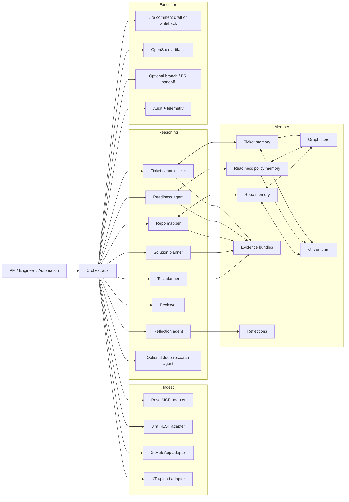
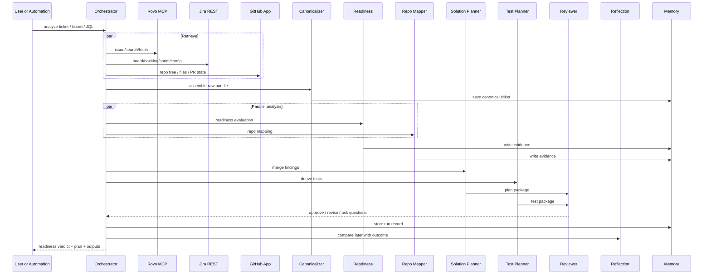

# AGENTS.md — product-overlord

Conventions and knowledge for AI agents working in this repository.

---

## Ticket Conventions

- **Ticket keys** follow the pattern `PROJECT-N` (e.g. `DEMO-42`, `INFRA-10`). The project key is always uppercase.
- **Issue types** recognised by the readiness engine: `story`, `bug`, `task` (case-insensitive). Unknown types fall back to the task profile.
- **Status values** treated as open blockers by the scorer: `"Open"`, `"To Do"`, `"todo"` (case-insensitive match).
- **Status values** treated as resolved: `"Done"`, `"Closed"`, `"Resolved"`.
- A dependency is a **hard blocker** only when it appears in `ticket.dependencies[]` with an open status. Links in `linked_artifacts` are informational only.

---

## Acceptance Criteria Aliases

The normaliser (`src/normaliser/normalise.ts`) resolves any of the following field names as the canonical `acceptance_criteria` field (case-insensitive):

| Alias |
|---|
| `Acceptance Criteria` |
| `AC` |
| `ACs` |
| `Business Requirements` |
| `Functional Requirements` |
| `Requirements` |
| `Definition of Done` |
| `DoD` |

If none of these fields is found (or the field is empty), `acceptance_criteria` is set to `null` and a `high`-severity missing item is recorded.

---

## Readiness Dimensions

Dimensions are defined per profile in `src/readiness/profile.ts`.

### Story dimensions

| Dimension ID | Weight | Severity | Clarification persona |
|---|---|---|---|
| `business_intent` | 0.15 | high | pm |
| `acceptance_criteria` | 0.30 | high | pm |
| `scope_boundaries` | 0.15 | medium | pm |
| `dependencies_declared` | 0.20 | high | engineer |
| `rollout_constraints` | 0.10 | low | engineer |
| `test_hints` | 0.10 | medium | qa |

### Bug dimensions

| Dimension ID | Weight | Severity | Clarification persona |
|---|---|---|---|
| `actual_behaviour` | 0.15 | high | pm |
| `expected_behaviour` | 0.15 | high | pm |
| `repro_steps` | 0.25 | high | engineer |
| `environment` | 0.15 | medium | engineer |
| `evidence` | 0.15 | medium | engineer |
| `affected_services` | 0.10 | medium | engineer |
| `exit_criteria` | 0.05 | low | qa |

### Task dimensions

| Dimension ID | Weight | Severity | Clarification persona |
|---|---|---|---|
| `summary_clarity` | 0.30 | high | pm |
| `acceptance_criteria` | 0.35 | high | pm |
| `dependencies_declared` | 0.20 | medium | engineer |
| `assignee_set` | 0.15 | low | pm |

---

## Scoring & Verdicts

- **Score** is 0–100, derived from the weighted sum of passing dimensions.
- **`ready`**: score ≥ 80 AND no open blocker dependencies AND no missing items.
- **`needs_clarification`**: score < 80 OR any `high`-severity missing item (and no blockers).
- **`blocked`**: any dependency in `ticket.dependencies[]` has status `Open` or `To Do`.
- **Confidence** (0.0–1.0): ratio of populated fields across all dimensions, penalised 0.2 for each open blocker.

---

## Branch-Name Convention

```
<type>/<short-description>
```

Examples:
- `feat/readiness-profile-overrides`
- `fix/ac-alias-normalisation`
- `chore/update-default-bug-profile`
- `test/scorer-edge-cases`

Types: `feat`, `fix`, `chore`, `test`, `docs`, `refactor`.

---

## Key Source Files

| File | Purpose |
|---|---|
| `src/types/index.ts` | All shared TypeScript types |
| `src/normaliser/normalise.ts` | Canonical ticket normaliser + AC alias resolution |
| `src/adapters/rovo-mcp.ts` | Rovo MCP adapter (OAuth 2.1 / API token) |
| `src/adapters/jira-agile-rest.ts` | Jira Agile REST adapter (board/sprint/backlog) |
| `src/adapters/ingestion-orchestrator.ts` | Dual-adapter orchestration + fallback logic |
| `src/readiness/profile.ts` | Readiness profile schema + ProfileRegistry + default profiles |
| `src/readiness/scorer.ts` | Deterministic scoring engine |
| `src/readiness/clarification.ts` | Persona-targeted question generator |
| `src/evidence/store.ts` | Evidence bundle store (UUID run_id, ≥ 90-day retention) |
| `src/output/comment-draft.ts` | Jira comment draft emitter (human-gated) |
| `src/repo/repo-adapter.ts` | GitHub Cloud + Bitbucket Cloud repo adapter (≤ 20 GB guard) |
| `src/repo/component-indexer.ts` | Component dossier builder (framework/test/owner/convention detection) |
| `src/repo/teamwork-graph.ts` | Teamwork Graph enrichment client (linked PRs/branches/builds — enrichment-only) |
| `src/repo/index-refresh.ts` | Incremental + full re-index manager |
| `src/repo/mcp-resources.ts` | MCP resource registry (`repo://`, `pattern://` URIs) |
| `src/repo/mapper.ts` | Semantic + structural component ranking against canonical ticket |
| `src/repo/stage2-orchestrator.ts` | Parallel readiness + repo-mapping orchestration (stage-2) |
| `src/planning/solution-planner.ts` | Merges readiness + repo-map into ActionPackage; conflict detection |
| `src/planning/reviewer.ts` | 5-rule validation gate before artifact emission |
| `src/planning/openspec-emitter.ts` | Writes OpenSpec change package to `openspec/changes/<slug>/` |
| `src/utils/logger.ts` | Structured JSON logger |
| `src/utils/retry.ts` | `withRetry()` with exponential back-off |
| `src/utils/latency.ts` | p95 latency tracker + `record()` for pre-computed durations |
| `src/utils/confidence-histogram.ts` | Repo-mapper confidence histogram (task 5.2) |

---

## Invariants — Never Violate

1. **No autonomous Jira writes** — `emitCommentDraft()` only produces a draft; the `confirm_post_url` gate must be presented to a human before any write.
2. **No credential logging** — tokens and API keys must never appear in log output or evidence bundles.
3. **Scoring is deterministic** — no LLM calls inside `scoreTicket()`; all logic is code.
4. **Evidence is always persisted** — even on `blocked` and `needs_clarification` verdicts; never silently dropped.
5. **Partial output is prohibited** — if ingestion fails, no evidence bundle is written and no draft is emitted.

---

## Stage-2: Repo Memory Conventions

### Component ranking
- Ranking combines **semantic** (Jaccard keyword similarity, weight 0.6) and **structural** (name/label/co-change signals, weight 0.4) scores into a 0.0–1.0 confidence.
- `low_confidence: true` is set when the top component scores ≤ 0.5. Never fabricate a high-confidence match.
- Top-K defaults to 5 candidates. Rationale (`why`) is always populated.

### Test-location patterns
- Known test dirs are detected from `__tests__`, `tests/`, `spec/`, `e2e/`, `cypress/`, `playwright/` directories in the repo tree.
- If `testDirs` is empty, `testLocationKnown: false` and `test_location_unknown: true` are set on the map result.
- Do not assume a test location; surface the flag honestly.

### OpenSpec change slug format
- Slugs are lowercase, hyphen-separated, URL-safe: `[a-z0-9][a-z0-9-]*[a-z0-9]`
- Slugs are derived from `{ticketKey}-{summary-slug}`, e.g. `abc-123-improve-webhook-retry`
- Written to `openspec/changes/<slug>/`

### Teamwork Graph enrichment
- Enrichment data (linked PRs/branches/builds) is **beta** and tagged `enrichmentOnly: true`.
- It MUST NOT be the sole grounding for any ranking decision.
- When the graph is unavailable, `enrichment_source: "unavailable"` is logged and the structural index is used instead.

### MCP resources
- `repo://{repoFullName}/{componentName}` → `ComponentDossier`
- `pattern://{projectKey}/{ticketId}` → `RepoMapResult`
- Registered via `mcpRegistry` singleton in `src/repo/mcp-resources.ts`.

---

## Stage-2 Invariants

6. **Parallel branches** — readiness and repo-mapping start simultaneously after normalisation; neither waits for the other.
7. **Repo unavailability is non-fatal** — `repo_map: null` is returned and readiness continues independently.
8. **Conflict is surfaced, never suppressed** — when readiness=`ready` but repo confidence < 0.3, `conflict` field is populated in the ActionPackage.
9. **Branch name must contain work-item key** — `branch_name_suggestion` always prefixes with the lowercase ticket key.
10. **OpenSpec writes require human confirmation** — `openspec-emitter.ts` never writes without `ReviewerVerdict.approved === true` AND user confirmation (or shadow mode).

---

## Running Tests

```bash
npm test             # run all tests once
npm run test:watch   # watch mode
npm run test:coverage  # coverage report
```

All tests must pass before merging. The rollout gate requires:
- Adapter contract tests passing
- Scoring unit tests passing
- ≥ 1 manual grooming session reviewed in shadow mode

---

## Stage-3: Forge / Rovo Agent Conventions

### Forge endpoint URL pattern
| Endpoint | Path | Max response |
|---|---|---|
| Ingest single issue | `POST /forge/ingest/issue` | 4.5 MB |
| Board sweep (paginated) | `GET /forge/ingest/board/{id}?cursor=&page_size=` | 4.5 MB / page |
| Retrieve action package | `GET /forge/plan/{run_id}` | 4.5 MB |
| Confirm Jira comment post | `POST /forge/output/confirm/{run_id}` | 1 MB |

All endpoints require an `Authorization: Bearer <token>` header. Unauthenticated requests receive HTTP 401.

### Payload-size guard
- Implemented in `src/forge/endpoints.ts` (`applySizeGuard`).
- When `JSON.stringify(response)` exceeds **4.5 MB** (4 718 592 bytes) the `action_package` field is stripped, `status` is set to `"truncated"`, and `next_cursor` carries the `run_id` so the full package is retrievable via `deep_link`.
- Do not increase this limit — Forge has a 5 MB ceiling and we reserve 0.5 MB for envelope overhead.

### Forge envelope schema
Every ingest/plan response returns a `ForgeEnvelope`:
- `run_id` — UUID from evidence store
- `summary` — ≤ 500-char human-readable summary
- `verdict` — `"ready"` | `"needs_clarification"` | `"blocked"`
- `score` — 0–100
- `top_missing_items` — max 3 entries with `dimension` + `severity`
- `deep_link` — URL to the full package outside Forge
- `confirm_post_url` — URL the user must POST to write the Jira comment
- `status` — `"ok"` | `"timeout"` | `"truncated"`

### Invocation patterns for Rovo Dev CLI
- `analyseTicketAction({ issue_key, deep_analysis? }, authToken)` — triggers the "Analyse this ticket" card
- `boardSweepAction({ board_id, cursor?, page_size? }, authToken)` — paginated board sweep; call again with `next_cursor` for "load more"
- `confirmCommentAction(action, "post" | "discard", authToken)` — the ONLY path that writes to Jira; requires explicit user choice

### CSRF protection (task 6.4)
- A UUID CSRF token is generated at `handleIngestIssue` time and stored in `_csrfTokens` (keyed by `run_id`).
- `POST /forge/output/confirm/{run_id}` validates the token before writing; a mismatch returns HTTP 403.
- CSRF tokens are consumed on first use (one-time, then deleted from the map).
- Never skip the CSRF check in production code paths.

### No autonomous Jira writes (invariant 11)
- `analyseTicketAction` and `boardSweepAction` have `autonomous_write: false` on every return type.
- The confirmation prompt (`confirmCommentAction`) is the ONLY path that calls `handleConfirmPost`.
- Integration tests assert this (`3.6` tests in `forge-agent.test.ts`).

### Forge action metrics (task 6.1)
- Recorded via `forgeInstrumentation.recordAction(metric)` in `src/forge/instrumentation.ts`.
- `metric.action` values: `"analyse_ticket"`, `"board_sweep"`.
- `forgeInstrumentation.errorRate(action)` and `p50LatencyMs(action)` are available for dashboards.
- `forgeInstrumentation.recordDeepLinkClick(event)` tracks `deep_link` click-throughs (task 6.2).

---

## Stage-3: Subagent Scoping Rules

### Operational subagent
- Scoped to ONE project via `buildOperationalScope(projectKey, confluenceSpace?, extraRepos?)` in `src/forge/subagent.ts`.
- Knowledge sources: `jira_project: <key>`, `confluence_space: <space>`, `repo://<key>/*`, `policy://<key>/*`.
- **Cannot** access other projects' Jira issues, Confluence pages, or repo data.
- Boundary check: call `assertScopeExcludes(scope, otherProjectKey)` — throws on violation.

### Research subagent (opt-in)
- Trigger: `deep_analysis: true` in `AnalyseTicketAction`, or when `ticket.readiness_status === "blocked"` AND user explicitly requests it.
- Rate limit: **30 requests per user per calendar day** (enforced in `createResearchSubagentConfig`).
- Timeout: **15 minutes** (`RESEARCH_SUBAGENT_TIMEOUT_MS = 900_000`).
- Always gets a fresh `session_id` (UUID) — **never** shared with the operational subagent.
- Isolation test: call `assertSubagentIsolation(operationalSessionId, researchConfig)` — throws if IDs match.

---

## Stage-3: EAP A2A Connector Rules

- Feature flag: `FEATURE_ROVO_AGENT_CONNECTOR` env var (default `"false"`).
- When `false`: all A2A handlers return `{ accepted: false, feature_disabled: true }` with a clear message. No data is lost. Callers fall back to the manual Forge agent path.
- When `true` (only after confirmed EAP approval): A2A events are forwarded to `handleIngestIssue` and a `confirm_post_url` draft is returned — no autonomous Jira write.
- Manifest entry: `type: "rovo:agentConnector"`, key `"product-overlord-a2a"` — disabled by default.
- Activation gate (task 6.6): EAP approval confirmed + stage-4 integration tests passing + `FEATURE_ROVO_AGENT_CONNECTOR=true` flipped only in production.

---

## Stage-3 Invariants

11. **No autonomous Jira writes** — every write path requires an explicit `confirmCommentAction("post")` call from the human user.
12. **Payload ≤ 4.5 MB** — `applySizeGuard` in `endpoints.ts` enforces this; full packages are always accessible via `deep_link`.
13. **Subagent knowledge is project-scoped** — the operational subagent has no org-wide access; `assertScopeExcludes` is the enforcement mechanism.
14. **Research subagent is isolated** — different `session_id` to operational subagent; `assertSubagentIsolation` verifies this.
15. **A2A is feature-flagged off by default** — `FEATURE_ROVO_AGENT_CONNECTOR=false`; must not be flipped without EAP approval.
16. **CSRF tokens are one-time** — consumed on first use; reuse returns HTTP 403.

---

## Key Source Files (Stage-3 additions)

| File | Purpose |
|---|---|
| `src/forge/types.ts` | Forge-specific TypeScript types (envelope, actions, A2A, subagent, metrics) |
| `src/forge/endpoints.ts` | Four Forge-callable HTTP endpoint handlers (2.1–2.5) |
| `src/forge/rovo-agent.ts` | Rovo agent action surfaces: analyse, sweep, confirm (3.1–3.4) |
| `src/forge/a2a-connector.ts` | EAP A2A connector shell — feature-flagged off (4.1–4.5) |
| `src/forge/subagent.ts` | Subagent scoping + research subagent factory + rate limiting (5.1–5.4) |
| `src/forge/instrumentation.ts` | Forge action latency/error-rate metrics + deep_link click-through (6.1–6.2) |
| `src/forge/deep-research.ts` | Deep-research subagent runner: isolated session, rate limit, 15-min timeout |

---

## Stage-4: Reflection Workflow & Memory-Promotion Rules

### When is a reflection candidate created?
A `ReflectionCandidate` is enqueued (non-blocking, via `queueMicrotask`) whenever:
- A human **corrects** a readiness verdict after analysis (`trigger: "correction"`)
- A ticket is **completed** (developer confirms which components were actually touched; `trigger: "ticket_completion"`)
- A solution plan is **declined** by the reviewer (`trigger: "declined_plan"`)

The function to call is `enqueueReflection(trigger)` from `src/eval/reflection-agent.ts`.

### Reflection queue rules
- **MAX_QUEUE_SIZE = 500** — when the queue is full, the oldest *pending* candidate is dropped (never approved/rejected ones).
- The queue is **read-only** for callers — `getReflectionQueue()` returns a `readonly` array.
- Candidates have status `"pending" | "approved" | "rejected"`.

### Memory promotion rules (invariant 17)
- **Live readiness profiles and repo memory are NEVER updated directly by the reflection agent.**
- Approved candidates write a `PolicyDelta` (field-level) and a `RepoMemoryDelta` (component-level) to **separate in-process stores** (`pendingPolicyDeltas`, `pendingRepoMemoryDeltas`).
- A human reviewer must call `approveCandidate(candidateId, reviewerId)` — this is the ONLY path that produces deltas.
- `rejectCandidate(candidateId, reviewerId)` records the decision with provenance but produces no memory writes.
- Double-approval throws; rejected/approved candidates cannot be re-reviewed.
- Deltas include full provenance: `candidate_id`, `reviewer`, `timestamp`.

### Promotion gate (pre-rollout)
Before promoting memory deltas to production, ALL of the following must be true:
1. `classification_agreement ≥ 85%` (latest eval run)
2. `precision_at_3 ≥ 80%` (latest eval run)
3. All permission-boundary tests passing
4. ≥ 1 full shadow-replay run reviewed by the team

Call `checkRolloutGate({ permissionBoundaryTestsPassing, shadowReplayRunsReviewed })` from `src/eval/observability.ts`.

---

## Stage-4: Eval Dataset Conventions

### Gold-set format (`src/eval/gold-set.ts`)
| Field | Description |
|---|---|
| `id` | Stable `gs-NNN` identifier |
| `prompt` | Natural-language description (mirrors what a PM would write) |
| `issue_type` | `"story"` \| `"bug"` \| `"task"` \| `"regression"` |
| `bucket` | `"ready"` \| `"needs_clarification"` \| `"blocked"` |
| `expected_readiness_status` | Must equal `bucket` |
| `expected_top_components` | ≤ 5 repo component names expected to appear in the plan |
| `tags` | Used for slice-based metric analysis (e.g. `"ac-alias"`, `"repo-ambiguity"`, `"permission-sensitive"`) |
| `fixture` | Optional: inlined ticket fields for deterministic eval (no live Jira call) |

### Distribution requirements
- Exactly 1/3 `ready`, 1/3 `needs_clarification`, 1/3 `blocked`
- ≥ 10 entries tagged `"ac-alias"`
- ≥ 10 entries tagged `"repo-ambiguity"`
- ≥ 6 entries tagged `"permission-sensitive"`

Run `validateGoldSetDistribution(goldSet)` to check — throws on violation.

### Adding new entries
1. Pick the next `gs-NNN` ID.
2. Assign a `bucket` that maintains ±1 of the 1/3 / 1/3 / 1/3 split.
3. Tag appropriately.
4. Re-run `validateGoldSetDistribution` before committing.

---

## Stage-4: Shadow-Mode Replay

- **No Jira writes** — `runShadowReplay()` only calls `normaliseTicket → scoreTicket → applyQuestions`.
- Each replayed ticket produces one `AuditRecord` in the audit store.
- The `AuditRecord` holds: `record_id`, `replay_run_id`, `issue_key`, `verdict`, `human_triage_verdict`, `verdict_match`, `adapter_traces`, `agent_outputs`, `correction_log` (append-only), `promotion_status`, `eval_run_id`, `evidence_run_id`.
- `exportAuditLog(replayRunId)` → newline-delimited JSON (one object per line).
- `drillDownEvidence(recordId)` → full evidence bundle from the evidence store.

---

## Stage-4 Invariants

17. **Live memory is frozen until approval** — `pendingPolicyDeltas` and `pendingRepoMemoryDeltas` accumulate approved deltas; the live profile and repo memory are untouched until a deployment process applies them.
18. **Eval runner is read-only** — `runEvaluation()` and `runShadowReplay()` never call the confirm endpoint or write to Jira.
19. **Deep-research sessions are isolated** — `runDeepResearch()` always gets a fresh `session_id` (UUID); `assertSubagentIsolation` is called at the start of every job.
20. **Rate limit is per-user per UTC calendar day** — the key is `${userId}:YYYY-MM-DD`; `_resetRateLimits()` is for tests only.
21. **Audit log is append-only** — `correction_log` entries are pushed; never spliced or cleared.
22. **Rollout is gated** — `checkRolloutGate()` must return `gate_pass: true` before any promotion delta is applied to production config.

---

## Key Source Files (Stage-4 additions)

| File | Purpose |
|---|---|
| `src/eval/gold-set.ts` | 48-entry gold-set dataset + `validateGoldSetDistribution()` |
| `src/eval/eval-runner.ts` | Shadow-mode eval runner: classification agreement, precision-at-3, regression alert |
| `src/eval/reflection-agent.ts` | Reflection candidate queue + human-review approve/reject + memory-promotion stores |
| `src/eval/shadow-replay.ts` | Shadow-mode replay pipeline + audit record store + structured log export |
| `src/eval/observability.ts` | Eval metrics trend, promotion queue depth, stale-candidate alert, rollout gate |
| `src/forge/deep-research.ts` | Deep-research subagent: isolated session, rate limit, 15-min timeout |

---

## Stage-6: LLM Enrichment & Knowledge Base

### Overview

Stage-6 adds an **OpenAI-compatible LLM adapter**, a **KT document knowledge base** (file upload + URL crawl → LanceDB vector store), **RAG retrieval** at analysis time, and **GitHub file content fetching**. All new behaviour is behind `DEGRADED_LLM=true` so existing deterministic pipelines continue to pass unchanged in test environments.

Feature flag: `DEGRADED_LLM` env var (default `"false"`). When `true` (or when `LLM_API_KEY` is absent), a `MockLLMAdapter` is used — traces will have `degraded: true` and no real API call is made.

---

### LLM Adapter Contract (`src/llm/`)

- **Interface** — `LLMAdapter` in `src/llm/types.ts` exposes two methods:
  - `complete<T>(context: PromptContext): Promise<{ result: T; trace: LLMTrace }>` — structured JSON completion
  - `embed(texts: string[]): Promise<number[][]>` — batch embedding
- **`LLMTrace`** — always returned alongside every response. Fields: `model`, `prompt_tokens`, `completion_tokens`, `latency_ms`, `degraded: boolean`, `reason?: string`.
- **`LLMDegradedError`** — thrown by `OpenAICompatAdapter` when the upstream API is unreachable and there is no fallback configured.
- **`MockLLMAdapter`** (`src/llm/mock-adapter.ts`) — deterministic mock for tests. Use `setFixture(substringMatch, response)` to register per-prompt fixtures. All traces have `degraded: true`.
- **Factory** — `createLLMAdapter(config)` in `src/llm/index.ts` — returns `OpenAICompatAdapter` in production or `MockLLMAdapter` when `config.featureFlags.llmEnabled === false`.
- **Rate limiter** (`src/llm/rate-limiter.ts`) — per-process token-bucket; calls exceeding `LLM_CALLS_PER_MINUTE` are queued with exponential back-off.

### LLM Prompt Registry (`src/llm/prompts.ts`)

| Function | Purpose |
|---|---|
| `enrichReadinessPrompt(ticket, score, missingItems)` | Returns a `PromptContext` asking the LLM for additive readiness observations |
| `groundPlanPrompt(ticket, repoMap, ktContext)` | Returns a `PromptContext` asking the LLM to justify component/file choices in a solution plan |

---

### RAG Retrieval Invariants (`src/rag/`)

- **`retrieveChunks(query, projectKey, topK?)`** — wraps `KBStore.search()` with a **2-second `Promise.race()` timeout**. On timeout or any error, returns `[]` (never throws). The pipeline always continues.
- **`fetchTopFiles(candidates, repoAdapter, topN?)`** — top-N repo files by confidence. Files > 100 KB are silently skipped. Content is truncated to 8 000 tokens before use. Fetch errors are non-fatal.
- **`buildContext(chunks, files)`** — assembles KT chunks + file content into a `<context>` block within a **12 000-token budget**. File content is truncated first; then lowest-scoring KT chunks are dropped.

### RAG invariants

28. **RAG is non-blocking** — a timeout or store failure in `retrieveChunks` must never fail a pipeline run; it returns `[]` and execution continues.
29. **File fetch is non-fatal** — errors from `fetchTopFiles` are logged and skipped; the plan proceeds with whatever files were successfully fetched.
30. **Context budget is fixed at 12 K tokens** — `buildContext` never emits a block that exceeds this; it truncates deterministically (file content first, then low-scoring chunks).

---

### KB Ingestion Invariants (`src/knowledge/`)

- **Upload limit** — individual file uploads are capped at **50 MB**. Exceeding this throws `FileTooLargeError` (HTTP 413).
- **Store capacity** — total store size is capped at `KB_MAX_SIZE_GB`. Exceeding this throws `StoreFullError` (HTTP 507).
- **Supported formats** — PDF, Markdown (`.md`), plain text (`.txt`), HTML (`.html`). Unknown extensions throw `UnsupportedFormatError` (HTTP 422).
- **Project partitioning** — every chunk is stored with a `project_key` field. `KBStore.search()` always filters by `project_key`; chunks from one project are never served to another.
- **Chunk shape** — 512-token chunks with 64-token overlap. Each chunk carries: `source_id`, `project_key`, `chunk_index`, `text`, `embedding`.
- **Shadow mode** — all `/kb/*` write endpoints (`POST /kb/ingest`, `POST /kb/crawl`, `DELETE /kb/sources/:id`) return HTTP 403 when `SHADOW_MODE=true`.

31. **KB is project-scoped** — `KBStore` always filters by `project_key`; cross-project data leakage is structurally impossible.
32. **Ingestion is transactional** — a failure during chunk embedding or store write does not leave partial data; the source entry is removed on error.

---

### Pipeline Enrichment Rules (Stage-6)

The enrichment pass in `src/repo/stage2-orchestrator.ts` follows these rules:

- LLM enrichment runs **after** `scoreTicket()` — it may add new `MissingItem` entries (`source: "llm"`) or add `justification` strings to clarification questions, but it **never** reduces the existing score and **never** changes a `blocked` verdict.
- The enrichment call has a **10-second hard timeout**. On expiry, the deterministic result is used unchanged.
- `planActionPackage()` is `async`. It calls `groundPlanPrompt` with a **10-second timeout** and falls back to heuristic `why`/`reason` strings on timeout or error.
- All LLM traces are collected into `EvidenceBundle.llm_traces[]` and returned in `Stage2Result.llm_traces`.
- All retrieved KB chunks are collected into `EvidenceBundle.retrieved_chunks[]` and returned in `Stage2Result.retrieved_chunks`.

---

### New Environment Variables (Stage-6)

| Variable | Required | Default | Description |
|---|---|---|---|
| `LLM_API_KEY` | No | — | API key for the OpenAI-compatible LLM endpoint |
| `LLM_BASE_URL` | No | `https://api.openai.com/v1` | Base URL of the LLM API |
| `LLM_MODEL` | No | `gpt-4o-mini` | Model name to use for completions |
| `EMBEDDING_MODEL` | No | `text-embedding-3-small` | Model name to use for embeddings |
| `KB_STORE_PATH` | No | `.kb/` | Directory for LanceDB vector store data |
| `KB_MAX_SIZE_GB` | No | `2` | Maximum total KB store size in gigabytes |
| `LLM_CALLS_PER_MINUTE` | No | `60` | Rate-limit budget for LLM API calls |
| `DEGRADED_LLM` | No | `false` | When `true`, use mock adapter (no real API calls) |

---

### Key Source Files (Stage-6 additions)

| File | Purpose |
|---|---|
| `src/llm/types.ts` | `LLMAdapter` interface, `LLMTrace`, `LLMDegradedError`, `PromptContext` |
| `src/llm/openai-compat.ts` | `OpenAICompatAdapter` — structured JSON completion + embedding |
| `src/llm/mock-adapter.ts` | Deterministic mock adapter for tests (all traces `degraded: true`) |
| `src/llm/rate-limiter.ts` | Per-process call budget with exponential back-off queue |
| `src/llm/prompts.ts` | Typed prompt templates: `enrichReadinessPrompt`, `groundPlanPrompt` |
| `src/llm/index.ts` | `createLLMAdapter(config)` factory |
| `src/knowledge/types.ts` | `KBChunk`, `KBSource`, `RetrievedChunk`, `IngestResult`, error types |
| `src/knowledge/chunker.ts` | 512-token / 64-token-overlap text chunker |
| `src/knowledge/parser.ts` | PDF, Markdown, plain-text, HTML parsers |
| `src/knowledge/crawler.ts` | URL crawler (depth 1–3, 30s timeout, same-origin links) |
| `src/knowledge/embedder.ts` | Batch embedder wrapping `LLMAdapter.embed()` |
| `src/knowledge/store.ts` | `KBStore` wrapping LanceDB — project-scoped CRUD + vector search |
| `src/knowledge/index.ts` | `KnowledgeBase` facade: `ingestFile()`, `crawlUrl()`, `listSources()`, `deleteSource()` |
| `src/rag/retrieval.ts` | `retrieveChunks()` with 2s timeout guard |
| `src/rag/file-fetcher.ts` | `fetchTopFiles()` with 100 KB + 8 K-token limits |
| `src/rag/context-builder.ts` | `buildContext()` — 12 K-token budget assembler |

---

## Stage-5: Runtime Server and CI

### What was added

- **`src/server/config.ts`** — Zod env schema with `loadConfig()` and degraded-mode boolean flags (`SHADOW_MODE`, `DEGRADED_REPO`, `DEGRADED_DEEP_RESEARCH`, `DEGRADED_A2A`).
- **`src/server/app.ts`** — `createApp(config): Hono` factory wiring the 4 Forge routes + `/health`, shadow-mode 403 guard.
- **`src/index.ts`** — Entry point: `loadConfig → createApp → serve` with graceful SIGTERM/SIGINT shutdown.
- **`.env.example`** — All 9 env vars documented with required/optional labels.
- **`.github/workflows/ci.yml`** — GitHub Actions CI: test + typecheck on push/PR; rollout-gate check on `main`.
- **`package.json`** — Added `typecheck` script (`tsc --noEmit`), `hono`, and `@hono/node-server` runtime deps.

### Invariants (stage-5 additions)

23. **Server refuses to start without required env vars** — `loadConfig()` throws a `ZodError` if `JIRA_BASE_URL`, `JIRA_API_TOKEN`, `JIRA_USER_EMAIL`, or `GITHUB_TOKEN` are missing.
24. **Shadow mode blocks all writes** — when `SHADOW_MODE=true`, every request to a non-health endpoint returns HTTP 403 with `{"error":"shadow_mode"}`.
25. **Degraded-mode flags disable the corresponding adapter** — `DEGRADED_REPO`, `DEGRADED_DEEP_RESEARCH`, and `DEGRADED_A2A` each independently gate the matching subsystem; the server remains up and returns degraded responses.
26. **`/health` is always reachable** — shadow mode and degraded flags do NOT affect the `/health` endpoint.
27. **CI must pass before merge** — the GitHub Actions workflow runs `npm test` and `npm run typecheck`; both must succeed.

### Key Source Files (Stage-5 additions)

| File | Purpose |
|---|---|
| `src/index.ts` | Server entry point — config load, app creation, graceful shutdown |
| `src/server/config.ts` | Zod env schema, `loadConfig()`, `ServerConfig` type, degraded-mode flags |
| `src/server/app.ts` | Hono app factory, route wiring, shadow-mode guard |
| `.env.example` | Documented env var template |
| `.github/workflows/ci.yml` | GitHub Actions CI — test, typecheck, rollout gate |

# Agent Operating Model for Jira + GitHub Assistant

This repository defines a production-oriented, hybrid AI operating model for a Jira Cloud + GitHub Cloud product and project management assistant: use Atlassian Rovo MCP for issue/JQL/natural-language retrieval and connected Atlassian context where available, use Jira Software Cloud REST as the source of truth for boards, backlogs, sprints, and board configuration, use a GitHub App plus webhooks for repository-grounded indexing and refresh, and keep durable project memory in this `AGENTS.md` plus external vector and graph stores. That recommendation matches the current documented platform boundaries: Atlassian Rovo MCP is a cloud bridge for Jira, Confluence, and Compass with OAuth 2.1 as the primary auth model and optional API-token auth; its documented tool surface covers Jira issue operations, JQL search, Rovo search/fetch, and beta Teamwork Graph context, while Jira Software Cloud separately documents board, backlog, sprint, and configuration endpoints; Rovo Dev CLI uses `AGENTS.md` and `AGENTS.local.md` for project memory and supports specialized subagents; and OpenSpec’s official workflow is spec-first, centered on `propose` / `apply` with optional expanded commands such as `verify`. citeturn19view7turn19view3turn19view4turn16view1turn17view0turn22search0turn12view0turn5search0turn5search2turn5search3

## Stage-7: Agent Orchestration UI (agent-orchestration-ui)

### Overview

Stage-7 adds a full **Desktop UI** (Tauri 2 + React 18 + TypeScript) layer over the orchestration backend, wiring connections, decision review, workflow execution and scheduling, live agent reporting via SSE, an OrchestratorTeam watchdog, and custom agent authoring. The backend modules below are all new additions introduced by this change.

---

### ConnectionManager (`src/connections/ConnectionManager.ts`)

- Manages named provider connections (`jira`, `openai`, `github`).
- Credentials are stored via **SecretStore** (`src/connections/SecretStore.ts`), which uses Tauri Stronghold when available and falls back to an encrypted file at `CREDENTIAL_STORE_PATH`.
- Invariants:
  - `save(provider, config)` — encrypts and persists credentials; never logs secret values.
  - `load(provider)` — returns a masked config (all secret fields replaced with `"***"`).
  - `test(provider)` — performs a live connectivity check; returns `{ ok, message }`.
  - `list()` — returns saved provider names only; never returns raw credentials.

### DecisionQueue (`src/decisions/DecisionQueue.ts`)

- In-memory ring buffer (default 200 entries) for human-review decision items.
- Methods: `enqueue(item)`, `approve(id, note?)`, `reject(id, reason)`, `modify(id, patch)`, `list(filter?)`.
- `_resetForTests()` — test-only helper; wipes the queue and resets state.
- Invariants:
  - Decisions are append-only; IDs are UUIDs generated at enqueue time.
  - Approve/reject/modify are synchronous; they update `status` and return the updated `Decision | null`.
  - Ring eviction removes the oldest item when capacity is reached.

### WorkflowEngine (`src/workflows/WorkflowEngine.ts`)

- Orchestrates the `crawl → normalise → embed → upsert (LanceDB)` pipeline.
- Methods: `plan(stages)`, `run(stages, runId?)`, `stop(runId)`, `listRuns()`.
- `plan(stages)` — dry-run mode; returns a `PlanResult` (`{ stages, estimated_tokens, estimated_cost_usd }`) without writing anything.
- `run(stages)` — executes stages sequentially; each stage emits `AgentEvent`s via `AgentEventBus`.
- `stop(runId)` — sets an abort signal; running stages check it at each iteration and halt within 3 s.
- Invariants:
  - A `run_id` is a UUID; multiple concurrent runs are allowed.
  - `stop()` does not throw if the run is already complete.
  - Stage errors are caught per-stage; they emit an `error` event and mark the run `failed` without aborting other in-flight stages unless the stage is marked `critical`.

### WorkflowScheduler (`src/workflows/WorkflowScheduler.ts`)

- CRUD wrapper around `node-cron` schedules, persisted to `data/workflows/schedules.json`.
- Methods: `upsert(schedule)`, `delete(id)`, `list()`, `enable(id)`, `disable(id)`.
- Invariants:
  - Cron expressions are validated before persistence; invalid expressions throw `CronValidationError`.
  - Disabled schedules are stored but their cron jobs are stopped immediately.
  - On process restart, all enabled schedules are re-registered from the persisted file.

### AgentEventBus (`src/agents/AgentEventBus.ts`)

- In-process pub/sub for agent lifecycle and progress events.
- Ring buffer with configurable capacity (default 500) for SSE replay.
- Key methods: `emit(event)`, `subscribe(filter, handler)`, `replay(filter, since?)`, `unsubscribe(token)`.
- Helper emitters: `emitProgress(runId, stage, pct)`, `emitError(runId, stage, err)`, `emitDone(runId)`.
- Invariants:
  - All events carry `ts: number` (Unix ms), `run_id`, and `stage`.
  - SSE clients receive a replay of buffered events on connect, filtered by `run_id` or `agent_id`.

### AgentRegistry (`src/agents/AgentRegistry.ts`)

- Manages registered agent definitions and active run state.
- Methods: `register(def)`, `list()`, `get(id)`, `setRunning(id, runId)`, `clearRunning(id)`.
- Invariants:
  - Agent IDs are derived from `name` (slugified); duplicate names are rejected.
  - `clearRunning` is idempotent.

### CustomAgentBuilder (`src/agents/CustomAgentBuilder.ts`)

- Generates and writes `AGENTS.md`, `SOUL.md`, and `SKILLS.md` to `data/agents/<name>/`.
- Input: `AgentDraft` — `{ name, description, role, persona, skills[], maxConcurrency, rpmCap, tpmCap, retryPolicy }`.
- Invariants:
  - All three files are written atomically (tmp → rename).
  - File content is deterministic given the same draft — safe to regenerate without data loss.
  - Agent name is slugified (`/[^a-z0-9-]/g → ""`) before use as a directory name.

### OrchestratorTeam (`src/orchestrators/OrchestratorTeam.ts`)

- Watchdog service that monitors `AgentEventBus` for anomalous patterns.
- **Detectors**:
  - **Thrash** — same stage emitting `progress` events N times without advancing (default N = 5).
  - **Stall** — no events from a run for longer than `ORCHESTRATOR_STALL_TIMEOUT_S` (default 120 s).
  - **Runaway** — a run that exceeds `ORCHESTRATOR_RUNAWAY_TIMEOUT_S` (default 600 s) of wall-clock time.
- Methods: `start()`, `stop()`, `listFindings()`, `getFinding(id)`, `ack(id)`, `escalate(id)`.
- Invariants:
  - Findings are stored in a ring buffer (default 100) and exposed via `GET /api/orchestrator/findings`.
  - `ack()` marks a finding resolved; `escalate()` promotes it to `severity: "critical"`.
  - OrchestratorTeam does not directly stop workflows — it emits a finding and the UI or a human decides to call `WorkflowEngine.stop()`.

---

### UI Shell & Theme (`ui/src/components/layout/`, `ui/src/theme/`)

**Capability: `ui-shell`**

| File | Purpose |
|---|---|
| `ui/src/components/layout/TitleBar.tsx` | Custom draggable titlebar; macOS traffic-light controls; Stop All button |
| `ui/src/components/layout/Sidebar.tsx` | Icon-only nav for all 21 panels; spring active-indicator |
| `ui/src/components/layout/MainContent.tsx` | Hash-router panel dispatcher; spring page transitions |
| `ui/src/components/layout/ThemeProvider.tsx` | OS dark/light detection; `[data-theme]` toggle |

**Capability: `ui-theme`**

| File | Purpose |
|---|---|
| `ui/src/theme/tokens.css` | All CSS custom properties; dark/light adaptive |
| `ui/src/theme/glass.css` | `backdrop-filter` utilities; `@supports` solid fallback; `prefers-reduced-motion` suppression |
| `ui/src/components/glass/` | `GlassPanel`, `GlassCard`, `GlassButton`, `GlassBadge`, `GlassInput`, `GlassModal`, `GlassToast`, `ScoreGauge` |

**Capability: `ui-api-client`**

| File | Purpose |
|---|---|
| `ui/src/api/client.ts` | `apiFetch<T>()` — typed fetch with auth header and `Result<T>` return |
| `ui/src/api/useMetricsStream.ts` | SSE hook → `logStore`; auto-reconnect |
| `ui/src/api/queries/hooks.ts` | React Query hooks for status, config, forge, KB, eval, evidence |
| `ui/src/api/queries/agentHooks.ts` | React Query hooks for connections, decisions, workflows, agents, orchestrators |

---

### Desktop UI Panels (`ui/src/panels/`)

| Panel | Route | Purpose |
|---|---|---|
| `ConnectionsPanel` | `/connections/:provider` | Save/test Jira, OpenAI, GitHub credentials |
| `DecisionReviewPanel` | `/decisions` | Approve, reject, or modify pending decisions |
| `WorkflowPanel` | `/workflows` | Run/plan pipeline, schedule cron jobs |
| `AgentActivityPanel` | `/agents` | Live SSE feed of agent events; launch `AgentBuilderModal` |
| `OrchestratorFindingsPanel` | `/orchestrators` | View/ack/escalate thrash, stall, runaway findings |

### UI Stores (`ui/src/stores/`)

| Store | State |
|---|---|
| `connectionsStore` | Per-provider config + test results |
| `decisionsStore` | Decision ring buffer + filter |
| `workflowStore` | Selected stages, plan result, runs, schedules |
| `agentActivityStore` | Active runs, SSE event log |
| `orchestratorStore` | OrchestratorTeam findings |

### Invariants (stage-7 additions)

28. **Credentials are never logged or stored in plain text** — `ConnectionManager.load()` always masks secret fields before returning them to the UI.
29. **Stop All is always reachable** — `TitleBar` renders a "Stop All" button whenever `agentActivityStore` has ≥ 1 active run; it calls `useStopAllAgents()` which iterates over active run IDs and calls `WorkflowEngine.stop()` for each.
30. **Plan mode never writes** — `WorkflowEngine.plan()` is read-only and never calls stage executors that mutate state.
31. **OrchestratorTeam never auto-stops a run** — findings are advisory; only explicit human action (UI stop button or API call) terminates a run.
32. **All new SSE endpoints** (`/api/agents/events`, `/api/orchestrator/events`) stream `text/event-stream`; clients must handle reconnect with `Last-Event-ID`.

---

## Mission and operating assumptions

This file is the source of truth for how agents should reason, retrieve context, preserve memory, and ask for approval in this repository. It is intentionally explicit so the orchestrator, specialist agents, and human reviewers converge on the same workflow and output contracts.

Assumptions for this repo:

- **Platform defaults:** Jira Cloud and GitHub Cloud.
- **Atlassian context path:** Atlassian Rovo MCP is preferred when available.
- **Board-level truth:** Jira Software Cloud REST is authoritative for boards, backlog, sprint, and board configuration.
- **Repository truth:** GitHub App + GitHub REST + webhooks are authoritative for code, repo structure, and pull-request state.
- **Project memory:** checked-in `AGENTS.md` is durable team memory; `AGENTS.local.md` is local-only override memory and should be ignored by Git; external vector and graph stores hold retrieval memory, not policy authority.
- **Spec authority:** OpenSpec artifacts define implementation intent, requirements, design, and task slices for large changes.

Atlassian documents that project memory in Rovo Dev CLI is stored in `AGENTS.md` and `AGENTS.local.md`, while user memory is separate; memory files are markdown; subagents can be scoped with selected memory files, tools, and system prompts. Atlassian also documents that Rovo Dev in Jira supports GitHub Cloud repositories, provided the user has read/write access and the repository is under 20 GB. citeturn22search0turn22search5turn12view5

Non-goals for this repo:

- autonomous merges
- unsupervised production changes
- unrestricted third-party data sharing
- inferring missing business requirements without asking
- treating vector recall as a source of truth
- replacing product, architecture, security, or code-owner review

## System architecture and orchestration

Use a four-plane architecture: **ingest**, **memory**, **reasoning**, and **execution**. Keep all deterministic checks in code, including approval gating, policy evaluation, permission enforcement, rate limiting, retry policy, and output schema validation. Use language models for interpretation, synthesis, ranking, and explanation, not as the final arbiter of safety or correctness.

Atlassian’s current documentation supports a hybrid posture rather than an all-in-one Jira-native agent shell. Rovo MCP is production-facing and OAuth-based, while the Jira-native remote agent connector is currently EAP and requires an Agent2Agent server; the Teamwork Graph Forge API is also EAP and explicitly described as test-organization oriented unless you have an approved path to production. In addition, Forge Rovo action modules have a documented 5 MB data handling limit, which is another reason to keep heavy repository indexing and evidence bundles outside the Jira-native shell. citeturn19view8turn19view9turn20view0

### Source-of-truth rules

- **Issue search by JQL:** use Rovo MCP `searchJiraIssuesUsingJql` when the host already has Atlassian MCP connected, or Jira Cloud issue search REST when you need direct control over fields and pagination. citeturn19view3turn18view0
- **Natural-language discovery across Jira and Confluence:** use Rovo MCP `searchAtlassian` and `fetchAtlassian`. citeturn19view4
- **Board, backlog, sprint, and column-state truth:** use Jira Software Cloud REST `Get all boards`, `Get issues for board`, `Get board backlog`, `Get all sprints`, and `Get configuration`. Board configuration includes the filter, subquery, and `columnConfig`, and the last mapped column is treated as the board’s done column. citeturn16view1turn16view5turn17view0turn17view2
- **Cross-entity linked context:** use Rovo MCP `getTeamworkGraphContext` when available, but treat it as an optional context overlay because the documented MCP surface marks it beta and the Forge Teamwork Graph API remains EAP. citeturn19view2turn19view9
- **Repo structure and file bodies:** use GitHub REST trees and contents endpoints, plus a GitHub App installation token scoped to the needed repositories and permissions. citeturn0search3turn0search11turn21search4turn21search5
- **Fresh repo updates:** prefer GitHub webhooks over polling. GitHub’s own best-practice guidance recommends webhooks to stay under the API rate limit. citeturn21search5turn24view0turn24view1
- **Do not use Rovo Search as the hot-path source of repo freshness:** Atlassian documents that GitHub content appears in Rovo Search incrementally over the next few hours after connection. citeturn9search0



The internal agent fabric should mirror MCP’s own division of concerns: **resources** for stable context, **prompts** for reusable instruction templates, and **tools** for side effects. MCP’s official architecture, resource, prompt, and tool specifications make that split explicit and are a good design model for this repo’s internal contracts. citeturn6search7turn6search5turn6search1turn6search12



### Timing, rate, and merge defaults

Use these as repo defaults unless an environment-specific override exists:

```yaml
orchestration_defaults:
  max_parallel_ticket_agents: 4
  ticket_run_timeout_seconds: 180
  repo_mapper_timeout_seconds: 120
  reviewer_timeout_seconds: 60
  optional_deep_research_timeout_seconds: 900
  retry_policy:
    max_retries: 3
    backoff: exponential_jitter
    honor_retry_after_header: true
  partial_degradation:
    if_jira_board_unavailable: continue_with_issue_or_jql_path
    if_repo_index_stale: continue_with_live_github_sampling_and_lower_confidence
    if_teamwork_graph_unavailable: continue_without_graph_overlay
```

The optional deep-research path should stay exceptional rather than default. Atlassian documents that deep research takes longer, up to 15 minutes, that automations time out after 15 minutes, and that each user or automation is limited to 30 deep-research requests per day. citeturn26search0turn26search1turn26search2

## Agent roster and contracts

Subagents should stay narrow. Atlassian documents that subagents can have specialized capabilities, custom system prompts, tailored tool configurations, selected memory files, and project- or user-level scope; subagents only use the context supplied to them, which is exactly the behavior wanted for disciplined, parallel execution here. citeturn12view0turn22search5

### Common contract envelope

Every agent run should emit the same top-level envelope so the orchestrator can merge safely.

```json
{
  "run_id": "run_2026_05_03_001",
  "ticket_key": "ABC-123",
  "agent": "readiness-agent",
  "status": "ok",
  "confidence": 0.87,
  "inputs": {},
  "outputs": {},
  "evidence_ids": [],
  "warnings": [],
  "errors": [],
  "next_actions": [],
  "approval_gates_triggered": []
}
```

### Human approval gates

```yaml
approval_gates:
  jira_write:
    description: Required before posting comments, editing fields, or transitioning Jira issues.
  external_share:
    description: Required before sending data to any external product or non-approved MCP server.
  code_write:
    description: Required before branch creation, pushes, PR creation, or PR edits.
  memory_promote:
    description: Required before promoting reflections into durable readiness or repo memory.
  high_risk_change:
    description: Required for auth, payments, privacy, security, migrations, infra, or cross-repo changes.
```

### Confidence model

Use a deterministic score and let the reviewer adjust it downward, not upward.

```yaml
confidence_model:
  bands:
    high: ">= 0.85"
    medium: "0.65 - 0.84"
    low: "< 0.65"
  components:
    evidence_completeness: 0.35
    policy_alignment: 0.20
    repo_match_strength: 0.25
    recency_freshness: 0.10
    conflict_penalty: -0.10
  hard_caps:
    missing_acceptance_criteria_caps_at: 0.64
    missing_bug_repro_caps_at: 0.59
    stale_repo_index_caps_at: 0.74
    adapter_failure_caps_at: 0.69
```

### Orchestrator agent

- **Purpose:** fan out work, enforce schemas and timeouts, merge outputs, and stop unsafe or low-confidence actions.
- **Inputs:** ticket selector (`issueKey`, `projectKey`, `boardId`, `boardName`, or `jql`), run mode (`analysis`, `draft_comment`, `openspec_emit`), approval context, user identity, repo scope.
- **Outputs:** merged execution packet, final readiness verdict, clarification list, repo targets, test plan, OpenSpec package, telemetry.
- **Tools:** all read adapters; write adapters only after approval.
- **Memory access:** read all; write evidence bundles and run records; never directly promote reflections.
- **Failure modes:** adapter outage, schema mismatch, specialist timeout, contradictory specialist outputs.
- **Confidence rule:** minimum of reviewer confidence and weighted merged confidence.
- **Approval gates:** may trigger any gate; may not bypass any gate.

### Ticket canonicalizer agent

- **Purpose:** normalize Jira input into a single canonical ticket object and strip noise.
- **Inputs:** raw issue, comments, linked work, board metadata, selected Confluence or Atlassian fetch results, uploaded KT docs attached to the run.
- **Outputs:** canonical ticket JSON, extracted acceptance criteria, dependency list, ambiguity markers.
- **Tools:** Rovo MCP read/search/fetch, Jira REST issue read, Jira REST board/config read.
- **Memory access:** read readiness policy hints; write ticket memory and evidence bundle.
- **Failure modes:** empty description, malformed custom fields, conflicting linked artifacts, missing issue permissions.
- **Confidence rule:** based on field completeness and parse certainty.
- **Approval gates:** none unless asked to write normalization results back to Jira.

Atlassian’s own acceptance-criteria checker is a useful baseline for canonicalization: it reads requirements from the summary, description, and custom fields labeled `Acceptance Criteria`, `AC`, `ACs`, `Business Requirements`, `Functional Requirements`, `Requirements`, `Definition of Done`, or `DoD`, and it also works best when criteria are short, unambiguous, and measurable. citeturn14view0turn12view4

### Readiness agent

- **Purpose:** decide whether the work item is action-ready.
- **Inputs:** canonical ticket, project + issue-type readiness policy, dependency signals, linked evidence.
- **Outputs:** `ready`, `needs_clarification`, or `blocked`; missing dimensions; targeted questions; readiness score; constraints; manual checks.
- **Tools:** no write tools by default; read-only memory and Jira metadata.
- **Memory access:** read readiness policy memory and earlier ticket patterns; write evidence bundle only.
- **Failure modes:** policy not found, ambiguous issue type, contradictions between title/description/comments, insufficient bug detail.
- **Confidence rule:** hard-cap when required dimensions are absent.
- **Approval gates:** `jira_write` if turning questions into a Jira comment.

### Repo mapper agent

- **Purpose:** map the normalized ticket to likely components, files, services, docs, owners, and tests in GitHub.
- **Inputs:** canonical ticket, repo memory, graph links, live GitHub samples, uploaded KT docs.
- **Outputs:** ranked components, ranked files, likely API boundaries, test targets, ownership hints, repo confidence, uncertainty list.
- **Tools:** GitHub App read endpoints, vector search, graph traversal, optional Rovo Teamwork Graph overlay.
- **Memory access:** read repo memory and graph store; write evidence bundle only.
- **Failure modes:** stale index, missing repo access, mono-repo ambiguity, generated-code directories overwhelming search.
- **Confidence rule:** combine lexical hits, semantic similarity, ownership proximity, and historical fix patterns.
- **Approval gates:** none on read-only runs; `code_write` only if it is asked to open a branch or draft PR later.

### Solution planner agent

- **Purpose:** convert requirements plus repo grounding into an implementation proposal.
- **Inputs:** readiness output, repo mapping output, dependency/risk context.
- **Outputs:** implementation plan, change slice, risks, migration flags, manual steps, rollout notes, OpenSpec change slug.
- **Tools:** OpenSpec prompt templates, graph lookups, codebase memory.
- **Memory access:** read ticket, policy, repo, and evidence; no writes except generated artifacts.
- **Failure modes:** conflicting agent advice, cross-repo scope explosion, missing boundary docs, elevated-risk change.
- **Confidence rule:** inherits the lower of readiness and repo-mapping confidence unless the reviewer lowers it further.
- **Approval gates:** `high_risk_change` when touching auth, privacy, payments, data models, or production migrations.

### Test planner agent

- **Purpose:** identify what proves the change works.
- **Inputs:** canonical ticket, solution plan, repo mapping, existing test inventory.
- **Outputs:** unit/integration/e2e/manual test plan, negative cases, observability checks, rollout guards.
- **Tools:** repo memory, graph store, test-path heuristics, OpenSpec templates.
- **Memory access:** read repo memory and evidence bundle; write test evidence section.
- **Failure modes:** no existing test structure, missing environment fixtures, ambiguous behavior expectations.
- **Confidence rule:** tied to clarity of success criteria and location confidence for affected code.
- **Approval gates:** none unless asked to mutate CI config or create test files.

### Reviewer agent

- **Purpose:** perform final consistency, policy, and quality checks before output leaves the system.
- **Inputs:** all prior outputs plus run telemetry.
- **Outputs:** approved package, revision request, or clarification-required verdict.
- **Tools:** schema validators, policy rules, diff/comparison tools.
- **Memory access:** read all run artifacts; write review note into evidence bundle.
- **Failure modes:** contradicting findings, unsafe tool request, unexplained low confidence, output missing citations/evidence.
- **Confidence rule:** capped by weakest critical dependency and any unresolved contradiction.
- **Approval gates:** may trigger any gate and may block all write actions.

### Reflection agent

- **Purpose:** compare predicted work against what actually happened after implementation, review, or rejection.
- **Inputs:** final merged packet, resulting PRs/commits/issues/tests, human corrections, deployment notes.
- **Outputs:** reflection record, candidate policy deltas, candidate repo-memory deltas, false-positive/false-negative labels.
- **Tools:** GitHub PR and commit reads, Jira outcome reads, evaluation store.
- **Memory access:** read all; write **candidate** reflections only.
- **Failure modes:** ticket closed without PR, multiple PRs, rebased history, incomplete deployment evidence.
- **Confidence rule:** depends on outcome completeness and traceability from ticket to code.
- **Approval gates:** `memory_promote` always required before promotion.

### Optional deep-research agent

- **Purpose:** handle architecture-heavy, ambiguous, or evidence-intensive tickets that exceed the normal planning path.
- **Inputs:** focused research question, scoped custom knowledge sources, explicit time budget.
- **Outputs:** research memo with citations, dependency/risk matrix, unresolved questions.
- **Tools:** restricted research adapters only.
- **Memory access:** read-only by default; may write an evidence memo, not durable policy.
- **Failure modes:** time budget exhaustion, over-broad source scope, automation timeout.
- **Confidence rule:** never used for direct write actions; only advisory.
- **Approval gates:** `external_share` if it touches non-approved external tools; `memory_promote` before any learning.

Use the deep-research path sparingly. Atlassian documents that deep-research mode is best for heavyweight, evidence-backed work, takes up to 15 minutes, and is rate-limited per user or automation. citeturn26search0turn26search1turn26search2

## Jira ingestion, GitHub indexing, and memory design

### Jira intake workflow

Rovo MCP and Jira REST should work together, not compete. Rovo MCP is best for issue/JQL/natural-language discovery and fetch-style retrieval. Jira Software REST is best for board shape, columns, sprint windows, backlog, and deterministic paging. Atlassian’s current supported-tools page documents Jira issue actions plus JQL search, but board APIs are documented in Jira Software REST, not in the Rovo MCP tool list. citeturn19view3turn19view4turn16view1turn17view0

Use these intake modes:

```yaml
jira_intake_modes:
  by_issue_key:
    required: [issue_key]
    first_step: get_issue_bundle
  by_project:
    required: [project_key]
    first_step: jql_search
    recommended_jql: "project = {{project_key}} ORDER BY updated DESC"
  by_board:
    required: [board_id]
    steps:
      - get_board
      - get_board_configuration
      - get_issues_for_board
      - get_backlog
      - get_all_sprints
  by_jql:
    required: [jql]
    first_step: search_jira
  by_natural_language:
    required: [query]
    first_step: search_atlassian
    second_step: fetch_selected_aris
```

Board ingestion specifics:

- `Get all boards` returns only boards the caller can view. citeturn16view1
- `Get issues for board (enhanced)` and `Get board backlog` provide board-scoped and backlog-scoped issue retrieval with permission-aware results. citeturn16view5turn10view4
- `Get configuration` provides the board filter, subquery, and `columnConfig` so the system can infer which states count as “done” for that board. citeturn17view0turn17view2
- For JQL-first ingestion, Rovo MCP `searchJiraIssuesUsingJql` is a clean default for connected MCP hosts. citeturn19view3

### GitHub and KT indexing workflow

GitHub indexing should be event-driven, metadata-rich, and permission-scoped. GitHub documents trees and contents APIs for repo inventory and file retrieval, recommends least privilege for GitHub Apps, recommends webhooks instead of polling to stay under rate limits, and documents installation-token scoping by repository and permission with one-hour token expiry. GitHub also documents installation rate limits of 5,000 requests per hour by default and 15,000 requests per hour for installations on GitHub Enterprise Cloud organizations. citeturn0search3turn0search11turn21search4turn21search5turn14view2turn14view3

Recommended index flow:

```yaml
github_indexing:
  auth:
    mode: github_app_installation_token
    repository_scope: selected_repositories_only
    minimum_permissions:
      - metadata: read
      - contents: read
      - pull_requests: read
      - issues: read
      - checks: read
  bootstrap:
    - fetch_repo_tree
    - classify_paths
    - fetch_candidate_files
    - parse_symbols_and_sections
    - write_vector_chunks
    - write_graph_nodes_and_edges
  refresh:
    webhook_events:
      - push
      - pull_request
      - pull_request_review
      - check_suite
      - workflow_run
      - release
      - repository
    fallback_polling:
      enabled: false
      reason: prefer_webhooks_and_rate_limit_health
```

GitHub documents webhook events for `push`, `pull_request`, `pull_request_review`, `check_suite`, `workflow_run`, `release`, and `repository`, with explicit permission requirements for GitHub Apps on those events. Use `push` and `pull_request` as the mandatory refresh backbone; the others are optional overlays for richer outcome tracking. citeturn24view0turn24view1turn14view5turn24view4turn24view2turn24view3

Uploaded KT docs should be treated as first-class indexed documents:

- parse to clean markdown/plain text
- preserve original filename, uploader, upload time, visibility, and source tag
- chunk by headings and semantic sections
- link the doc to the ticket keys, components, services, or APIs it describes
- never assume an uploaded KT doc overrides live repo truth; instead, keep both and preserve a contradiction flag if they disagree

### Chunking and metadata defaults

Use these repo defaults unless an org-specific override exists:

```yaml
chunking_defaults:
  code:
    strategy: symbol_then_fallback_window
    target_lines: 120
    overlap_lines: 20
    max_lines: 220
  markdown:
    strategy: heading_sections
    target_tokens: 500
    overlap_tokens: 75
  yaml_json:
    strategy: object_or_section
    target_tokens: 350
  tickets:
    strategy: semantic_sections
    target_tokens: 400
  kt_docs:
    strategy: heading_sections
    target_tokens: 600
    overlap_tokens: 100

metadata_required:
  - source_type
  - source_system
  - repo
  - owner
  - branch
  - commit_sha
  - path
  - language
  - symbol
  - component
  - ticket_keys
  - doc_id
  - visibility_scope
  - permissions_fingerprint
  - updated_at
  - chunk_hash
  - embedding_model
  - embedding_dim
```

### Vector DB choices and recommendation

For this repo, the best default is typically **Postgres + pgvector** if you already operate Postgres and want the simplest production footprint. `pgvector` officially supports both HNSW and IVFFlat indexes, which gives you a practical speed/recall tradeoff inside a familiar relational system. If you need a more specialized vector engine, **Qdrant** is strong for filter-heavy retrieval because it supports payload filtering and payload indexes; **Weaviate** is strong if you want first-class hybrid vector + keyword retrieval using BM25F; and **Pinecone** is strong if you want a managed dense+sparse hybrid service with metadata filters. citeturn4search0turn4search7turn4search11turn4search2turn4search6turn4search1turn4search5

Recommended choice order:

- **Default:** Postgres + `pgvector`
- **Filter-heavy self-hosted:** Qdrant
- **Native hybrid search emphasis:** Weaviate
- **Managed service emphasis:** Pinecone

### Graph store choices and recommendation

A property-graph store is the cleanest way to represent tickets, files, components, services, docs, PRs, commits, tests, and the edges between them. Neo4j’s official docs describe its model as nodes, relationships, and properties, which maps directly to this problem. If your team already operates Neo4j or needs rich multi-hop traversals, use it. If you want the lightest operational footprint, keep graph edges in Postgres tables and reserve Neo4j for later. citeturn25search0turn25search3turn25search5

### Graph model

```yaml
graph_nodes:
  Ticket: [ticket_key, issue_type, project_key, status]
  Component: [component_id, name, repo, owner]
  File: [path, repo, language, branch]
  Symbol: [fq_name, kind, path]
  Test: [path, kind]
  Document: [doc_id, title, source_type]
  PullRequest: [repo, number]
  Commit: [repo, sha]
  Policy: [policy_id, project_key, issue_type]
  EvidenceBundle: [evidence_id, ticket_key]
  Reflection: [reflection_id, ticket_key]

graph_edges:
  - TICKET_AFFECTS_COMPONENT
  - COMPONENT_CONTAINS_FILE
  - FILE_DEFINES_SYMBOL
  - TEST_COVERS_COMPONENT
  - DOC_DESCRIBES_COMPONENT
  - TICKET_REFERENCES_DOC
  - PR_IMPLEMENTS_TICKET
  - COMMIT_TOUCHES_FILE
  - TICKET_HAS_EVIDENCE
  - REFLECTION_FROM_TICKET
  - POLICY_GOVERNS_TICKET
```

### Memory schemas

Project memory in Rovo Dev CLI is markdown-based and lives in `AGENTS.md` / `AGENTS.local.md`; use that for enduring human-readable rules and conventions. Use external stores for retrieval memory, evidence, and machine-generated reflections. citeturn22search0turn12view2

#### Ticket memory

```json
{
  "ticket_key": "ABC-123",
  "project_key": "ABC",
  "issue_type": "Story",
  "summary": "Add webhook retry observability",
  "canonical_description": "Expose retry attempts and terminal state for outbound payment webhooks.",
  "acceptance_criteria": [
    "The system SHALL record retry count for each webhook delivery.",
    "The system SHALL expose terminal status in the admin timeline.",
    "The system SHALL log retry exhaustion with correlation id."
  ],
  "definition_of_ready_status": "needs_clarification",
  "missing_dimensions": [
    {
      "name": "scope_boundary",
      "severity": "medium",
      "reason": "No explicit statement on whether historical events must be backfilled."
    }
  ],
  "dependencies": [
    "OBS-12",
    "PAY-9"
  ],
  "linked_docs": [
    "kt_2026_04_webhook_architecture"
  ],
  "linked_components": [
    "payments-webhook-service"
  ],
  "source_refs": [
    "jira:ABC-123",
    "doc:kt_2026_04_webhook_architecture"
  ],
  "created_at": "2026-05-03T14:12:00Z",
  "updated_at": "2026-05-03T14:12:00Z"
}
```

#### Readiness policy memory

```json
{
  "policy_id": "policy_ABC_story_v3",
  "project_key": "ABC",
  "issue_type": "Story",
  "required_dimensions": [
    "business_outcome",
    "scope_boundary",
    "acceptance_criteria",
    "dependencies",
    "rollout_constraints",
    "test_notes"
  ],
  "preferred_dimensions": [
    "design_links",
    "analytics_requirements",
    "support_impact"
  ],
  "blocking_rules": [
    "If acceptance_criteria is empty, cap confidence below 0.65.",
    "If rollout_constraints mention migration or customer-visible behavior, require high_risk_change gate."
  ],
  "good_examples": [
    "The admin SHALL see retry count and terminal status within 5 seconds of final attempt."
  ],
  "anti_examples": [
    "Improve observability",
    "Make retries better"
  ],
  "last_promoted_from_reflection_id": "refl_2026_04_19_008",
  "updated_by": "human-reviewer"
}
```

#### Repo memory

```json
{
  "component_id": "payments-webhook-service",
  "repo": "acme/payments-platform",
  "owners": [
    "team-payments-runtime"
  ],
  "paths": [
    "services/webhooks/",
    "libs/retry/",
    "packages/admin-timeline/"
  ],
  "languages": [
    "TypeScript"
  ],
  "frameworks": [
    "Node.js",
    "Express"
  ],
  "test_locations": [
    "services/webhooks/__tests__/",
    "packages/admin-timeline/src/__tests__/"
  ],
  "key_symbols": [
    "DeliveryRetryScheduler",
    "WebhookAttemptRepository",
    "TimelineEventPublisher"
  ],
  "operational_notes": [
    "Retries are scheduled via queue + delayed job.",
    "Admin timeline is eventually consistent."
  ],
  "related_docs": [
    "adr_retry_strategy_v2",
    "runbook_webhook_failures"
  ],
  "historical_ticket_keys": [
    "ABC-77",
    "ABC-98"
  ],
  "updated_at": "2026-05-02T18:10:00Z"
}
```

#### Evidence bundle

```json
{
  "evidence_id": "evid_run_2026_05_03_001",
  "ticket_key": "ABC-123",
  "retrievals": [
    {
      "source": "jira",
      "ref": "jira:ABC-123",
      "kind": "issue"
    },
    {
      "source": "github",
      "ref": "repo:acme/payments-platform/services/webhooks/handler.ts",
      "kind": "file"
    },
    {
      "source": "upload",
      "ref": "doc:kt_2026_04_webhook_architecture",
      "kind": "kt_doc"
    }
  ],
  "agent_findings": [
    {
      "agent": "readiness-agent",
      "finding": "No explicit backfill requirement."
    },
    {
      "agent": "repo-mapper",
      "finding": "Timeline rendering likely lives in packages/admin-timeline."
    }
  ],
  "contradictions": [],
  "generated_at": "2026-05-03T14:12:22Z"
}
```

#### Reflection

```json
{
  "reflection_id": "refl_2026_05_03_001",
  "ticket_key": "ABC-123",
  "predicted_readiness": "needs_clarification",
  "actual_outcome": "implemented_after_pm_answer",
  "predicted_components": [
    "payments-webhook-service",
    "admin-timeline"
  ],
  "actual_components": [
    "payments-webhook-service",
    "admin-timeline"
  ],
  "predicted_tests": [
    "retry_repository_unit",
    "timeline_render_integration"
  ],
  "actual_tests": [
    "retry_repository_unit",
    "timeline_render_integration",
    "queue_retry_exhaustion_e2e"
  ],
  "lessons": [
    "Backfill expectations are frequently omitted in observability stories.",
    "Timeline changes often need one e2e test even when unit coverage looks sufficient."
  ],
  "promotion_candidate": true,
  "requires_human_review": true
}
```

### Branch naming and traceability

Default branch names should include exactly one Jira work-item key, because Atlassian documents that its acceptance-criteria review checks use the branch name first when locating the linked work item. citeturn11view4

```yaml
branch_naming:
  default_pattern: "{ticket_key}/{short-kebab-summary}"
  examples:
    - "ABC-123/add-webhook-retry-observability"
    - "BUG-77/fix-timezone-regression"
```

## OpenSpec workflow and prompts

OpenSpec should be the planning and change-control layer for any change that is broader than a trivial one-file fix. OpenSpec’s official docs describe a default core workflow of `propose`, `explore`, `apply`, `sync`, and `archive`, plus expanded commands such as `new`, `continue`, `ff`, `verify`, `bulk-archive`, and `onboard`. The same docs recommend `openspec/config.yaml` for context and rules injection, and they explicitly keep implementation detail in `design.md` and `tasks.md`, not in `spec.md`. citeturn5search0turn5search2turn5search3

### OpenSpec project configuration

```yaml
schema: spec-driven

context: |
  Product: Jira + GitHub AI Project/Product Manager Assistant
  Platforms: Jira Cloud, GitHub Cloud
  Architecture:
    - Jira ingestion via Rovo MCP + Jira Software Cloud REST
    - GitHub indexing via GitHub App + webhooks
    - Retrieval memory via vector store + graph store
    - Durable human-readable project memory via AGENTS.md
  Safety:
    - Human approval required for Jira writes, code writes, external sharing, and memory promotion
    - No autonomous merges
    - Do not bypass permission boundaries
  Output package:
    - readiness verdict
    - missing information
    - questions for PM
    - repo targets
    - test plan
    - OpenSpec changes
    - evidence bundle

rules:
  proposal:
    - State assumptions, non-goals, risks, and rollback plan.
  specs:
    - Use SHALL or MUST language.
    - Every requirement must include at least one scenario.
    - Separate behavior from implementation detail.
  design:
    - Include architecture and sequence mermaid diagrams.
    - Define adapter boundaries, schemas, and failure modes.
  tasks:
    - Break work into MVP, hardening, and rollout slices.
    - Include security, observability, and evaluation tasks.
```

### OpenSpec command examples

OpenSpec’s docs also note that `openspec init` generates assistant-detectable skills and that project config is optional but recommended. citeturn5search0

```text
openspec init
openspec config profile
openspec update
```

```text
/opsx:propose jira-github-pm-assistant

Create a full-spec change for a Jira + GitHub AI Project/Product Manager Assistant.

Goals:
- analyze Jira tickets for readiness
- ingest tickets by issue key, project, board, and JQL
- index GitHub repos and uploaded KT docs
- map tickets to repo components, files, APIs, and tests
- emit action packages and OpenSpec artifacts
- preserve an evidence-backed memory system
- keep humans in control for all writes

Required spec domains:
- jira-ingestion
- readiness-evaluation
- repo-understanding
- orchestration
- output-contracts
- evaluation-and-governance

Constraints:
- Jira Cloud and GitHub Cloud
- no autonomous merge
- all state-changing actions behind human approval gates
- permission fidelity over retrieval breadth
```

```text
/opsx:apply jira-github-pm-assistant

Implement the MVP slice only:
- canonical ticket normalizer
- readiness scorer
- board / backlog / sprint ingestion
- repo tree + file indexer
- vector + graph write path
- repo-mapper ranker
- reviewer merge step
- telemetry + audit logging

If implementation changes required behavior:
- update spec deltas first
- then implement
- then verify
```

```text
/opsx:verify jira-github-pm-assistant

Verify the implementation against all OpenSpec artifacts.

Required checks:
- requirement to test traceability
- adapter contract tests
- readiness gold-set accuracy
- repo mapping precision@3
- permission-boundary tests
- stale-index and partial-degradation tests
- approval-gate tests
- audit log completeness
- rollback readiness
```

### Saved prompt pack for local agent tooling

If your team uses Rovo Dev CLI alongside this repo, keep reusable prompts in `.rovodev` and keep agent/project memory here. Atlassian documents saved prompts in markdown files referenced by `prompts.yml`. citeturn22search6turn22search0

```yaml
prompts:
  - name: readiness-gap-analysis
    description: Analyze what is missing from a Jira ticket before engineering can act.
    content_file: readiness_gap_analysis.md
  - name: repo-solution-plan
    description: Map a canonical ticket to likely repo components and implementation steps.
    content_file: repo_solution_plan.md
  - name: reflection-draft
    description: Compare predicted and actual work and draft a reflection record.
    content_file: reflection_draft.md
```

```text
# .rovodev/readiness_gap_analysis.md

Given a canonical Jira ticket object and a readiness policy object:
- decide ready / needs_clarification / blocked
- list missing dimensions
- generate only the minimum questions necessary
- be specific and measurable
- never invent acceptance criteria
- return valid JSON matching the readiness contract
```

## Testing, evaluation, and launch gates

Atlassian’s native Rovo agent evaluation flow requires a CSV dataset with a `prompt` column and an optional expected-response column, and the dataset cannot exceed 50 prompts. That is a good fit for UI-level evaluation, but this repo also needs a richer internal gold set for readiness classification, repo mapping, and approval-gate behavior. citeturn12view3

### Atlassian-compatible evaluation CSV

```csv
prompt,expected_response
"Analyze ABC-123 and tell me what is missing before engineering can start.","The response should identify missing acceptance criteria and ask for scope boundaries."
"Map BUG-77 to likely components and propose tests.","The response should identify the timezone utility package and propose unit plus regression tests."
```

### Internal gold-set CSV schema

```csv
case_id,ticket_key,issue_type,mode,input_selector,expected_status,expected_missing_dimensions,expected_top_components,expected_questions_json,expected_tests_json,permission_profile,notes
case_001,ABC-123,Story,board_scan,board:84,needs_clarification,"[""scope_boundary"",""acceptance_criteria""]","[""payments-webhook-service"",""admin-timeline""]","[""Should historical events be backfilled?""]","[""retry_repository_unit"",""timeline_render_integration""]",default,"Observability story with missing backfill scope"
case_002,BUG-77,Bug,issue_key,issue:BUG-77,ready,"[]","[""shared-timezone-lib""]","[]","[""timezone_parse_unit"",""customer_tz_regression_e2e""]",default,"Well-formed bug with reproduction steps"
```

### Evaluation prompts

```text
Generate 36 gold-set cases for this repo.

Balance:
- 12 ready
- 12 needs_clarification
- 12 blocked

Cover:
- stories
- bugs
- tasks
- board-derived tickets
- JQL-derived tickets
- ambiguous mono-repo matches
- permissions-sensitive cases
- stale-index cases
- acceptance-criteria alias cases
```

```text
Cluster failed cases by root cause.

Return:
- cluster_name
- representative_case_ids
- root_cause
- whether_to_fix_in:
  - deterministic_logic
  - readiness_policy_memory
  - repo_memory
  - prompts
  - adapter_code
- severity
- new_regression_tests
```

```text
Compare assistant outputs to the final merged PR and ticket resolution.

Return:
- readiness_verdict_correct: true|false
- missing_dimensions_missed: []
- repo_targets_missed: []
- tests_missed: []
- policy_updates_candidate: []
- repo_memory_updates_candidate: []
- should_promote_to_memory: true|false
```

### Launch gates

Use these default launch gates:

```yaml
launch_gates:
  readiness_classification_agreement: ">= 0.85 against reviewed gold set"
  repo_mapping_precision_at_3: ">= 0.80"
  zero_critical_permission_leaks: true
  audit_log_completeness: ">= 0.99 of runs"
  p95_standard_ticket_latency_seconds: "<= 45"
  deep_research_invocation_rate: "<= 5 percent of all runs"
```

## Security, observability, rollout, success metrics, and non-goals

### Security and permission rules

Use least privilege everywhere. Atlassian documents that the Rovo MCP permissions tab controls what the MCP server can read, write, and search across Atlassian apps and connected tools, and that OAuth 2.1 is the default connection model, while API-token authentication is optional and admin-controlled. Atlassian also documents domain allowlists and IP allowlists for Rovo MCP access, and that Rovo synchronizes with existing Atlassian and connected-app permissions so users only see content they already have access to. GitHub’s own guidance likewise recommends minimum permissions for GitHub Apps, explains how to scope installation tokens to selected repositories and permissions, and documents the `X-Accepted-GitHub-Permissions` header for discovering the permissions an endpoint actually requires. citeturn10view2turn10view1turn23search6turn23search14turn19view6turn21search5turn21search4turn21search0turn21search2

MCP security rules should also be treated as hard requirements, not suggestions. The MCP specification requires OAuth resource indicators and explicitly forbids token passthrough by MCP servers. citeturn6search0turn6search2turn6search13

Repository security rules:

```yaml
security_defaults:
  jira:
    auth: oauth_2_1_preferred
    api_token: allowed_only_for_non_interactive_shared_automation_if_admin_enabled
    writes_require_confirmation: true
  github:
    auth: github_app_installation_token
    selected_repositories_only: true
    least_privilege_permissions: true
    token_rotation: automatic
  external_sharing:
    disabled_by_default: true
    requires_gate: external_share
  secrets:
    never_store_in_vector_or_graph_memory: true
    never_echo_in_agent_output: true
    redact_before_logging: true
  memory_promotion:
    human_review_required: true
```

Atlassian also warns teams to review the type of data stored in connected third-party apps before connecting them, because third-party connectors and MCP-based integrations may involve data outside Atlassian’s control. This repo adopts that as a hard rule: **no external sharing, third-party MCP connection, or cross-system publication without explicit approval.** citeturn12view6turn8search1

### Observability and audit

Atlassian provides MCP activity monitoring and Rovo AI activity exports; GitHub provides organization audit logs. Use those platform logs, but do not depend on them as your only evidence source. Keep your own structured run log as the system-of-record for debugging and evaluation. Atlassian documents MCP activity visibility in audit logs and Rovo AI activity export to CSV; GitHub documents organization audit-log review. citeturn23search1turn23search2turn13view0

```json
{
  "run_id": "run_2026_05_03_001",
  "ticket_key": "ABC-123",
  "user_account_id": "redacted",
  "mode": "analysis",
  "timing_ms": {
    "total": 18122,
    "jira": 2200,
    "github": 4100,
    "readiness_agent": 1800,
    "repo_mapper": 5200,
    "reviewer": 900
  },
  "adapter_status": {
    "rovo_mcp": "ok",
    "jira_rest": "ok",
    "github_app": "ok",
    "vector_db": "ok",
    "graph_store": "ok"
  },
  "rate_limit_snapshot": {
    "github_remaining": 4388
  },
  "confidence": 0.87,
  "approval_gates_triggered": [
    "jira_write"
  ],
  "final_status": "needs_clarification",
  "evidence_id": "evid_run_2026_05_03_001"
}
```

Minimum telemetry fields:

- run id
- ticket key
- invoking user or service identity
- adapter latency and status
- rate-limit headers when available
- prompt or skill version
- policy memory version
- repo-memory snapshot id
- final confidence
- approval gates triggered
- reviewer decision
- output artifact ids

### Rollout phases

```yaml
rollout_phases:
  foundation:
    scope:
      - AGENTS.md finalized
      - OpenSpec config added
      - read-only Jira + GitHub adapters
      - vector + graph stores created
  planning_mvp:
    scope:
      - canonicalizer
      - readiness agent
      - repo mapper
      - reviewer
      - draft-only outputs
  governed_writeback:
    scope:
      - Jira comment drafts to confirmed writes
      - OpenSpec artifact generation
      - reflection capture
  learning_and_hardening:
    scope:
      - memory promotion workflow
      - richer evals
      - dashboards
      - latency tuning
  optional_jira_native_shell:
    scope:
      - remote agent connector or Forge wrapper
      - only after core quality stabilizes
```

The last phase remains intentionally optional because the most Jira-native remote-agent shell is still EAP, while the external orchestrator path is the safer production baseline today. citeturn19view8turn19view9

### Success metrics

Use these repo metrics:

- reduction in ticket clarification round-trips before first code work
- readiness-classification agreement with human reviewers
- repo-mapping precision at 1 and 3
- percent of runs that produce a usable action package on first pass
- percent of reflections promoted after human review
- p95 ticket-to-plan latency
- zero critical permission leaks
- zero unapproved external-sharing events

### Non-goals

This repo does **not** authorize agents to:

- merge pull requests
- approve their own high-risk changes
- promote memory without human review
- infer missing customer-facing behavior without asking
- move data to external tools by default
- bypass Jira or GitHub permission boundaries

### Local-only override guidance

Put the following **only** in `AGENTS.local.md` and never in `AGENTS.md`:

- temporary investigation notes
- local paths
- personal workflow preferences
- experimental prompts
- environment-specific debug instructions
- anything secret or user-specific

Atlassian documents `AGENTS.local.md` as project memory alongside `AGENTS.md`; this repo uses that split to keep checked-in memory stable and local overrides private. citeturn22search0