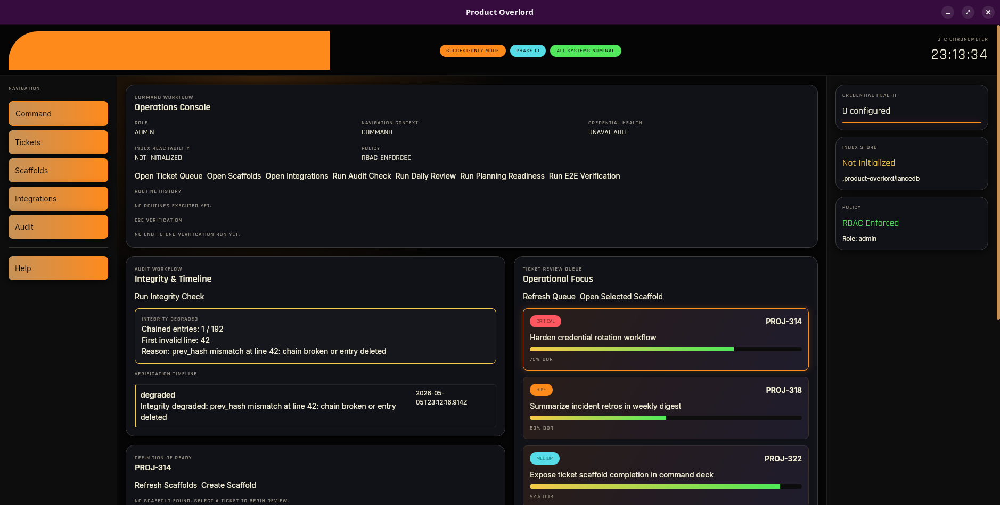

# product-overlord

An autonomous AI product manager desktop app. product-overlord monitors your Jira board, analyses ticket quality against your Definition of Ready, invokes LLMs to suggest improvements, and surfaces actionable insights — all running locally on your machine with no cloud dependency.

Built with **Tauri 2 + Rust** backend and a **SvelteKit + TypeScript** frontend styled in an LCARS aesthetic.
---



---

## What it does

- **Credential management** — stores API keys for Jira, GitHub, and LLM providers in the OS keychain (never on disk in plaintext)
- **Ticket scaffolding** — generates structured review scaffolds for Jira tickets including Definition of Ready checklist, acceptance criteria, and effort estimates
- **LLM integration** — routes prompts to OpenAI, Anthropic, Google Gemini, Ollama (local), or Atlassian Rovo
- **Repository index** — bootstraps a local LanceDB vector store for semantic repository search
- **Audit log** — append-only tamper-evident log of every privileged action with SHA-256 hash chain verification
- **Session-based auth** — role-gated access (ReadOnly / Operator / Admin) with TTL-bounded sessions; all protected commands fail-closed when the session is locked or expired
- **Input validation** — server-side JQL, cron expression, and base URL validators exposed as Tauri commands

---

## Application surfaces

The UI is divided into five navigation surfaces. Switching surfaces always triggers side effects — it is not a passive view swap.

### Command
The default landing surface. Clicking **Command** (or opening the app) immediately refreshes three health reads in parallel:
- Credential health for all stored integrations
- Index store reachability (LanceDB)
- Active policy / current role from the session

Use this surface to get a snapshot of system state, trigger daily review and planning readiness routines, or launch the E2E ops verifier.

### Tickets
Activating **Tickets** calls the Jira integration and hydrates the ticket review queue. The queue shows open tickets sorted by priority. Selecting a ticket loads its DOR scaffold (if one has been created) and makes it the active context for the Scaffolds surface.

### Scaffolds
Activating **Scaffolds** ensures the ticket queue is loaded, then opens the scaffold workspace for the selected ticket. A scaffold contains:
- **Definition of Ready checklist** — toggle items complete/incomplete
- **Acceptance criteria** — enter one criterion per line
- **Effort estimate** — band (XS–XL), optional story points, confidence %, and rationale

Changes are persisted to the Rust backend immediately on save. If no scaffold exists for the active ticket, create one with **Create Scaffold**.

### Audit
Activating **Audit** (or clicking **Run Integrity Check**) immediately runs `cmd_verify_audit_integrity` on the Rust backend. It does not just navigate — it triggers a live SHA-256 hash chain scan of the full audit log and reports:
- Total entries vs. chained (valid) entries
- First invalid line number and reason, when degraded
- A timestamped timeline of every past verification run in the current session

> Audit actions require an active unlocked session. The button is disabled when the session is locked or expired.

### Integrations
Activating **Integrations** opens the integration hub overlay (not a page navigation). The hub has three tabs:
- **LLM Connections** — configure and test LLM provider endpoints
- **Jira MCP** — connect and validate the Jira credential and project key
- **GitHub Repositories** — connect GitHub repos for repository index population

---

## Workflows

### Authenticate / manage session access

All protected operations require an active session. The session starts locked on every app launch.

1. Click the **Role** pill in the bottom status bar (shows `LOCKED` when no session is active).
2. Enter a **Principal ID** (your username or identifier).
3. Select a **Role**: Read Only, Operator, or Admin (see role matrix below).
4. Set a **TTL** in minutes (default 60, max 480).
5. Click **Unlock**.

The pill updates to show your current role and a live countdown timer. When the TTL expires the session auto-locks and you are prompted to re-authenticate.

| Role | Can do |
|---|---|
| **Read Only** | View credentials, tickets, scaffolds, audit log, system config |
| **Operator** | Everything above + add/delete credentials, configure LLM providers, invoke LLM, export audit log, manage notification rules, trigger repository index |
| **Admin** | Everything above + assign roles |

To lock early, click the role pill and cancel, or let the TTL expire naturally.

---

### Prepare tickets for work

**Goal:** Take a Jira ticket from backlog to ready-for-development by filling in its scaffold.

1. Unlock the session as **Operator** or higher.
2. Click **Tickets** in the nav rail — the queue loads from Jira.
3. Select a ticket from the queue to make it the active context.
4. Click **Scaffolds** in the nav rail — the scaffold workspace opens.
5. If no scaffold exists, click **Create Scaffold**.
6. Work through the **Definition of Ready** checklist — toggle each item complete.
7. Enter **Acceptance Criteria** (one per line) and click **Save Criteria**.
8. Fill in the **Effort Estimate**: band, optional story points, confidence, and rationale, then click **Save Estimate**.
9. The scaffold is immediately persisted. Return to Tickets to select the next ticket.

---

### Understand repositories

**Goal:** Bootstrap a local vector index over your codebase for semantic search.

1. Unlock the session as **Operator** or higher.
2. Click **Integrations** in the nav rail to open the hub.
3. Open the **GitHub Repositories** tab.
4. Add a GitHub credential (API token) with an appropriate label.
5. Enter the repository URL and branch, then save.
6. Return to the **Command** surface and verify **Index Reachability** shows `Reachable`.
7. If not initialized, click **Initialize Index Store** — this bootstraps the LanceDB vector store at `~/.product-overlord/index/`.
8. Use the **LLM Console** on the Command surface to run semantic prompts against the indexed content once an LLM provider is configured.

---

### Integrate LLMs

**Goal:** Connect one or more LLM providers so the app can invoke models for ticket analysis.

1. Unlock the session as **Operator** or higher.
2. Click **Integrations** → **LLM Connections** tab.
3. Select a provider from the dropdown (OpenAI, Anthropic, Gemini, Ollama, Atlassian Rovo).
4. For cloud providers:
   - Enter a **Credential Label** and **API Key**, then click **Save Credential**.
   - Select the saved credential from the dropdown.
5. For **Ollama** (local): no key required — set the base URL (e.g. `http://localhost:11434`).
6. Enter the **Model name** (e.g. `gpt-4o`, `claude-3-5-sonnet-20241022`, `llama3`).
7. Optionally enter a **Base URL** for custom endpoints.
8. Click **Save Provider**.
9. The provider appears in the configured list. A health indicator shows `configured` or `unreachable`.

To invoke a model from the **Command** surface:
1. Ensure an LLM provider is configured and a ticket is selected.
2. Edit the prompt in the **LLM Console** panel.
3. Select the target provider from the dropdown.
4. Click **Run Preview**.

> Phase 1 note: LLM invocations return stub responses. Live model inference is wired in Phase 2.

---

### Manage integrations

**Goal:** Add, rotate, or remove credentials for Jira, GitHub, and LLM providers.

**Add a credential**
1. Unlock as **Operator** or higher.
2. Open **Integrations** → relevant tab.
3. Fill in the label, secret, and optional base URL, then click **Save Credential**.
4. The secret is written directly to the OS keychain — it is never stored on disk.

**Check credential health**
1. Open **Integrations** → relevant tab.
2. Existing credentials show a health indicator (`valid`, `invalid`, `missing`, `unknown`).
3. Click **Check Health** next to any entry to re-validate against the provider.

**Delete a credential**
1. Locate the credential in the relevant tab.
2. Click **Delete** — this removes the keychain entry and the in-memory metadata.

**Rotate a credential** — delete the existing entry, then add a new one with the same label or a new one.

---

## Getting started

### Prerequisites

| Tool | Version |
|---|---|
| [Rust](https://rustup.rs/) | 1.77+ |
| [Node.js](https://nodejs.org/) | 20+ |
| [pnpm](https://pnpm.io/) | 9+ |
| [Tauri CLI prerequisites](https://v2.tauri.app/start/prerequisites/) | system libs for your OS |

### Install and run

```bash
# Install frontend dependencies
pnpm install

# Run in development mode (hot-reload frontend, auto-recompile Rust)
pnpm tauri dev
```

### Build for production

```bash
pnpm tauri build
```

---

## Supported LLM providers

| Provider | Type | Notes |
|---|---|---|
| **OpenAI** | Cloud | Requires API key stored in OS keychain |
| **Anthropic** | Cloud | Requires API key stored in OS keychain |
| **Google Gemini** | Cloud | Requires API key stored in OS keychain |
| **Ollama** | Local | No key required; configure base URL (default `http://localhost:11434`) |
| **Atlassian Rovo** | Cloud | Requires Rovo API credential |

Configure a provider via `cmd_configure_llm_provider`. Each provider configuration stores:
- Target model name
- Optional custom base URL (validated server-side before persistence)
- Optional credential reference (OS keychain entry, never serialized to disk)

> **Phase 1 note:** LLM invocations return stub responses. Live model inference is wired in Phase 2.

---

## Directory structure

```
product-overlord/
├── src/                        # SvelteKit frontend
│   └── routes/                 # Page components (LCARS UI)
├── src-tauri/                  # Rust/Tauri backend
│   ├── src/
│   │   ├── lib.rs              # Tauri app entry, command registration (26 commands)
│   │   ├── state.rs            # Shared AppState (all stores + session manager)
│   │   ├── errors.rs           # Typed AppError enum (PermissionDenied, Validation, Storage, …)
│   │   ├── sync_utils.rs       # lock_or_internal — poison-safe mutex helper (SEC-206)
│   │   ├── commands/           # Tauri command handlers
│   │   │   ├── audit.rs        # append_user_audit helper + cmd_verify_audit_integrity
│   │   │   ├── authz.rs        # effective_role(), require_permission() — session-aware
│   │   │   ├── credential.rs   # add / delete / list / health-check credentials
│   │   │   ├── index.rs        # initialize / health-check LanceDB index store
│   │   │   ├── llm.rs          # configure / list / invoke LLM providers
│   │   │   ├── permission.rs   # get / set active session role
│   │   │   ├── scaffolding.rs  # create / get / list ticket scaffolds
│   │   │   ├── session.rs      # unlock / lock / status session lifecycle
│   │   │   └── validation.rs   # JQL / cron / URL validation commands
│   │   ├── domain/             # Pure domain types (no I/O)
│   │   │   ├── audit.rs        # AuditLogEntry (with SEC-204 hash chain fields), AuditIntegrityReport
│   │   │   ├── credential.rs   # IntegrationCredential, Provider enum
│   │   │   ├── llm.rs          # LlmProvider, LlmProviderConfig, LlmInvocationRequest/Response
│   │   │   ├── notification.rs # NotificationRule domain type
│   │   │   ├── permission.rs   # Role (ReadOnly/Operator/Admin), Permission enum, role→permission mapping
│   │   │   ├── repository.rs   # Repository domain type
│   │   │   ├── scaffolding.rs  # TicketScaffold, EffortEstimate, DoR checklist
│   │   │   └── ticket.rs       # Jira ticket domain type
│   │   ├── llm/
│   │   │   └── mod.rs          # LlmGateway — routes invocations to provider clients
│   │   ├── security/
│   │   │   └── command_policy.rs  # Authoritative command policy table (SEC-205); completeness guard
│   │   ├── session/
│   │   │   └── mod.rs          # SessionManager, SessionState, TTL enforcement (SEC-201)
│   │   ├── storage/
│   │   │   ├── audit_store.rs  # Append-only JSONL audit log with SHA-256 hash chain (SEC-204)
│   │   │   ├── credential_store.rs  # In-memory metadata + OS keychain secret storage
│   │   │   ├── index_store.rs  # LanceDB local vector store bootstrap
│   │   │   ├── path_policy.rs  # Path sandboxing: confine all writes to ~/.product-overlord/ (SEC-203)
│   │   │   └── scaffold_store.rs    # In-memory ticket scaffold store
│   │   └── validation/         # JQL, cron, and URL validators (pure Rust, no I/O)
│   └── Cargo.toml
├── tests/                      # Frontend test suite (Vitest)
├── openspec/                   # OpenAPI specs and change records
├── static/                     # Static assets
├── svelte.config.js
└── vite.config.js
```

---

## Testing

### Run all tests

```bash
# Full validation (frontend typecheck → Vitest → build → Rust check → Rust tests)
pnpm check && pnpm test && pnpm build && cd src-tauri && cargo check && cargo test

# Rust tests only
cd src-tauri && cargo test

# Frontend typecheck only
pnpm check

# Frontend unit tests only
pnpm test
```

### Test coverage (149 Rust unit tests)

| Module | Tests | What's covered |
|---|---|---|
| `validation::cron` | 15 | Valid/invalid cron expressions, field ranges, aliases |
| `validation::url` | 14 | Scheme whitelist, localhost gating, traversal rejection, length cap |
| `validation::jql` | 12 | JQL keyword detection, injection chars, length limit |
| `storage::credential_store` | 12 | Add/delete/list, keychain stub, duplicate handling |
| `commands::authz` | 12 | Locked/expired/role-denied sessions, poisoned lock resilience |
| `storage::audit_store` | 10 | Append, read-all, hash chain linkage, tamper detection |
| `security::command_policy` | 9 | Policy completeness, no duplicates, PublicLocalOnly assertions |
| `domain::permission` | 9 | Role ordering, permission→role mapping, grant checks |
| `storage::path_policy` | 7 | In-root acceptance, traversal rejection, symlink escape, sibling rejection |
| `storage::scaffold_store` | 5 | CRUD, DoR status update, effort estimate |
| `storage::index_store` | 5 | Init, health check, URI validation, path confinement |
| `llm` | 4 | Provider config, stub invocation, disabled provider rejection |
| `errors` | 4 | Frontend-safe message masking, `Internal` variant |
| `domain::ticket` | 4 | Ticket domain type construction |
| `domain::repository` | 4 | Repository domain type |
| `domain::notification` | 4 | Notification rule domain type |
| `commands::session` | 4 | Unlock/lock lifecycle, TTL clamping, blank principal rejection |
| `domain::scaffolding` | 3 | Scaffold construction, DoR item defaults |
| `domain::credential` | 3 | Credential metadata, provider enum |
| `domain::audit` | 3 | Unique IDs, timestamp presence, correlation ID |

Frontend: 1 Vitest smoke test (build artifact validation).

---

## Security model

All protected commands require an active, non-expired session. The session is unlocked via `cmd_unlock_session` with a principal ID, role, and optional TTL (1–480 minutes, default 60). Every command is mapped to a policy in `security/command_policy.rs` — a compile-time completeness guard fails if any registered command is missing a policy entry.

Key controls implemented:

| Control | Location |
|---|---|
| Session-gated authorization | `commands/authz.rs` |
| Role-based permission table | `domain/permission.rs` |
| Command policy registry | `security/command_policy.rs` |
| Path sandboxing (all writes confined to `~/.product-overlord/`) | `storage/path_policy.rs` |
| Tamper-evident audit chain (SHA-256 HMAC chain) | `storage/audit_store.rs` |
| Poisoned-lock resilience (no `unwrap` on mutex in command paths) | `sync_utils.rs` |

---

## Recommended IDE setup

[VS Code](https://code.visualstudio.com/) + [Svelte](https://marketplace.visualstudio.com/items?itemName=svelte.svelte-vscode) + [Tauri](https://marketplace.visualstudio.com/items?itemName=tauri-apps.tauri-vscode) + [rust-analyzer](https://marketplace.visualstudio.com/items?itemName=rust-lang.rust-analyzer)


[def]: static/product-overlord.png