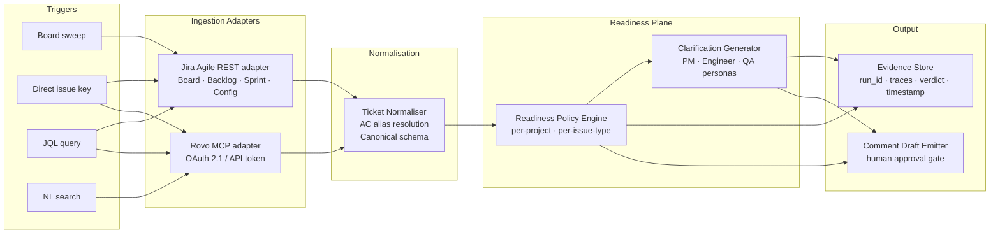
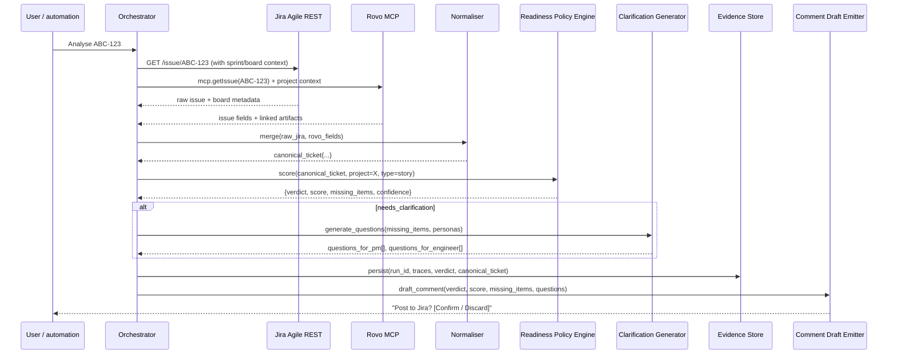

## Context

Jira tickets are not actionable for agents without project conventions, acceptance-criteria fields, and a scored definition of ready. This design covers the ingestion and readiness planes: the two adapter clients, the canonical normaliser, the readiness scoring engine, the clarification generator, and the evidence store. No repository analysis or autonomous writes are in scope.

## Goals / Non-Goals

**Goals:**
- Dual-adapter ingestion (Rovo MCP + Jira Agile REST) with graceful degradation
- Single canonical ticket schema consumed by all downstream agents
- Deterministic, code-based readiness scoring (no LLM-only logic for scoring)
- Persona-targeted clarification questions
- Human-gated Jira comment draft output
- Full evidence bundle retained per run

**Non-Goals:**
- Repository grounding (stage 2)
- OpenSpec artifact emission (stage 2)
- Autonomous Jira writes
- Forge embedding (stage 4)

## System Architecture



## Sequence: Single Ticket Analysis



## Component Contracts

### Rovo MCP Adapter
- **Auth:** OAuth 2.1 preferred; API token fallback
- **Endpoint:** MCP endpoint (note: SSE endpoint deprecated after 2026-06-30)
- **Operations:** `getIssue`, `searchIssues` (JQL), `naturalLanguageSearch`, `getProject`
- **Error handling:** retry ×3 with exponential back-off; emit `adapter_error` trace on failure

### Jira Agile REST Adapter
- **Operations:** `listBoards`, `getBoardIssues`, `getBacklogIssues`, `getSprintIssues`, `getBoardConfig`, `listSprints`
- **Error handling:** retry ×3; on exhaustion log `adapter_degraded: jira-agile-rest` and fall back to Rovo MCP individual fetch

### Canonical Ticket Schema
```json
{
  "ticket_key": "ABC-123",
  "ticket_type": "story | bug | task",
  "summary": "",
  "description": "",
  "acceptance_criteria": "string | null",
  "ac_field_source": "Acceptance Criteria | AC | DoD | ... | null",
  "issue_type": "",
  "status": "",
  "labels": [],
  "priority": "",
  "reporter": "",
  "assignee": "",
  "linked_artifacts": [],
  "dependencies": [{ "key": "", "relationship": "" }],
  "comments": [],
  "board_id": "",
  "sprint_id": "",
  "raw_fields": {}
}
```

### Readiness Policy Engine
- Scoring is **deterministic code**, not LLM prompt logic
- Inputs: canonical ticket + project readiness profile
- Outputs: `{ verdict, score (0–100), missing_items[], confidence (0.0–1.0), explanation }`
- Profile stored as structured JSON; updated only via promoted reflections (stage 3)
- Default profiles ship with the system for story/bug/task

### Evidence Store
- Keyed by `run_id` (UUID)
- Retained ≥ 90 days
- Fields: `run_id`, `timestamp`, `trigger`, `adapter_traces[]`, `canonical_ticket`, `scorer_input`, `scorer_output`, `verdict`, `questions`, `comment_draft_id`

## Failure Modes & Fallbacks

| Failure | Behaviour |
|---|---|
| Jira Agile REST 5xx | Retry ×3, then fall back to Rovo MCP individual fetch; log `adapter_degraded` |
| Rovo MCP unavailable | Return `blocked` verdict with `reason: adapter_unavailable`; no partial output |
| Both adapters unavailable | Return `blocked`; persist empty evidence bundle with error traces |
| Unknown project/issue-type | Apply default readiness profile; log `profile_source: default` |
| AC field not found | Set `acceptance_criteria: null`; add `high`-severity missing item |
