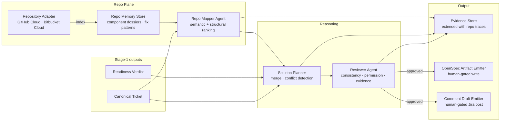
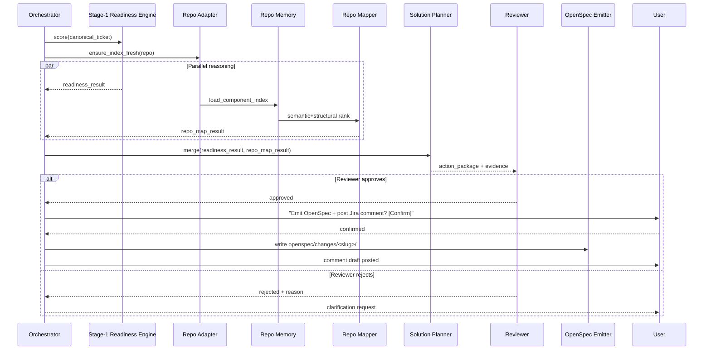

## Context

Stage 1 delivers a readiness verdict but no map from ticket language to the codebase. Engineers still locate affected code manually. This design covers the repository adapter, the repo memory store, the Repo Mapper agent, the Solution Planner, the Reviewer agent, and the OpenSpec artifact emitter. All stage-1 components are consumed as-is; this stage adds the repo grounding and synthesis layers above them.

## Goals / Non-Goals

**Goals:**
- Private, least-privilege repository indexing (semantic + structural)
- Parallel execution of readiness analysis and repo-mapping branches
- Conflict-surfacing merge by the Solution Planner
- Reviewer validation gate before any output is emitted
- OpenSpec artifact emission (human-gated write)

**Non-Goals:**
- Autonomous code writes or PR creation
- Forge embedding (stage 4)
- Deep-research subagent (stage 3)

## System Architecture



## Parallel Execution Sequence



## Component Contracts

### Repository Adapter
- **Supported:** GitHub Cloud, Bitbucket Cloud (read access, ≤ 20 GB)
- **Index contents:** component name, root paths, framework/runtime, owners, test dirs, conventions, fix examples
- **Linked-development context:** Teamwork Graph (beta) used for enrichment (PRs, branches, builds) — not sole grounding source
- **Incremental refresh:** on configurable interval; full re-index only on explicit request

### Repo Memory Store (MCP Resources)
```
repo://{repo}/{component}   → component dossier
pattern://{projectKey}/{id} → historical fix pattern
```

### Repo Mapper Agent Output Contract
```json
{
  "ticket_key": "ABC-123",
  "candidate_components": [
    { "name": "payments-api", "confidence": 0.86, "why": "..." }
  ],
  "candidate_files": [
    { "path": "src/payments/webhook.ts", "reason": "..." }
  ],
  "candidate_tests": [
    { "path": "tests/payments/webhook.test.ts", "reason": "..." }
  ],
  "low_confidence": false,
  "test_location_unknown": false,
  "evidence": []
}
```

### Solution Planner Output Contract
```json
{
  "ticket_key": "ABC-123",
  "readiness_status": "ready",
  "readiness_score": 87,
  "candidate_components": [],
  "candidate_files": [],
  "candidate_tests": [],
  "branch_name_suggestion": "ABC-123-improve-webhook-retry",
  "openspec_change_slug": "improve-webhook-retry-observability",
  "operational_risks": [],
  "manual_checks": [],
  "repo_map_confidence": 0.86,
  "low_confidence": false,
  "conflict": null,
  "evidence": []
}
```

### Reviewer Validation Rules
1. All required fields present and non-null (except `conflict`)
2. No referenced data exceeds the invoking user's permission scope
3. Readiness score ≥ minimum threshold OR explicit explanation present
4. `branch_name_suggestion` contains the work-item key
5. `openspec_change_slug` is valid kebab-case

### OpenSpec Artifact Emitter
- Writes to `openspec/changes/<slug>/`: `proposal.md`, `specs/**/*.md`, `design.md`, `tasks.md`
- Requires explicit user confirmation before any disk write
- Logs write event in evidence store with timestamp and run_id

## Failure Modes & Fallbacks

| Failure | Behaviour |
|---|---|
| Repo index unavailable | Emit `repo_map: null`, `reason: repo_index_unavailable`; continue readiness branch |
| Teamwork Graph unavailable | Use structural index only; log `enrichment_source: unavailable` |
| Repo > 20 GB | Reject connection with clear error |
| Reviewer rejects plan | Return to user with rejection reason; do NOT emit |
| Conflict detected | Surface in `conflict` field; never suppress |
