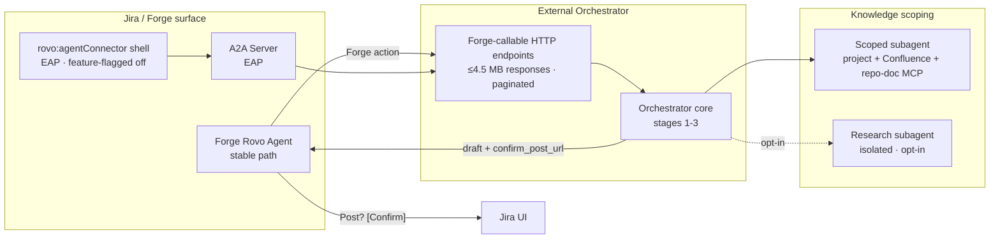

## Context

Stages 1–3 deliver a high-quality external planning engine. This stage projects it into Jira as a first-class UI surface via two paths: a lightweight Forge Rovo agent (stable, ships first) and an optional `rovo:agentConnector` remote-agent shell (EAP-gated, feature-flagged off by default). Neither path replaces the external orchestrator — both are thin UI projections that delegate all reasoning to it.

## Goals / Non-Goals

**Goals:**
- Forge Rovo agent with Jira-callable deterministic endpoints (≤ 5 MB payloads)
- `rovo:agentConnector` A2A shell behind a feature flag (EAP-only)
- Subagent scoped to project + Confluence space + repo-doc memory (not org-wide)
- Heavyweight research subagent path (isolated, opt-in)
- Human approval gate preserved end-to-end within the Jira UI

**Non-Goals:**
- All-in-Forge orchestration (external orchestrator remains the brain)
- Autonomous Jira writes or code merges
- Changes to stages 1–3 internals

## System Architecture



## Forge Rovo Agent Design

### Forge Action Endpoints
| Action | Endpoint | Max response |
|---|---|---|
| Analyse ticket | `POST /forge/ingest/issue` | 4.5 MB |
| Board sweep (paginated) | `GET /forge/ingest/board/{id}?cursor=` | 4.5 MB / page |
| Get action package | `GET /forge/plan/{run_id}` | 4.5 MB |
| Confirm Jira post | `POST /forge/output/confirm/{run_id}` | 1 MB |

### Forge Response Envelope
```json
{
  "run_id": "uuid",
  "summary": "≤500 chars",
  "verdict": "ready | needs_clarification | blocked",
  "score": 0,
  "top_missing_items": [],
  "deep_link": "https://planning-tool/runs/uuid",
  "confirm_post_url": "https://planning-tool/forge/output/confirm/uuid"
}
```

### Payload size guard
- If orchestrator response > 4.5 MB: return summary envelope + `next_cursor`
- Full bundles are always available via `deep_link`

## rovo:agentConnector Shell Design

- Requires Atlassian EAP approval before production activation
- Feature flag: `FEATURE_ROVO_AGENT_CONNECTOR=false` (default)
- A2A server receives assignment / @mention events → calls orchestrator → posts comment draft via confirm flow
- No new orchestration logic: purely an event bridge

## Subagent Knowledge Scoping

```yaml
operational_subagent:
  knowledge_sources:
    - jira_project: "{projectKey}"
    - confluence_space: "{associatedSpace}"
    - mcp_resources:
        - "repo://{repo}/*"
        - "policy://{projectKey}/*"
  excludes: "all_org_knowledge"

research_subagent:
  trigger: "explicit_request | ticket.ambiguous == true"
  isolation: "separate MCP session"
  rate_limit: "30/user/day"
  timeout: "15 minutes"
```

## Human Approval Gate (end-to-end)

1. Orchestrator returns action package + comment draft to Forge action
2. Forge action displays summary in Jira UI with **"Post comment / Discard"** prompt
3. User clicks Confirm → Forge action calls `POST /forge/output/confirm/{run_id}`
4. Orchestrator writes Jira comment under the user's credentials
5. Write event logged in evidence store with run_id + approver

## AGENTS.md Additions

Entries to be added for Rovo Dev CLI visibility:
- Forge action invocation patterns and payload limits
- Subagent scoping rules and knowledge boundaries
- Branch-name convention (work-item key required)
- Research subagent trigger conditions and rate limits

## Failure Modes & Fallbacks

| Failure | Behaviour |
|---|---|
| Forge payload > 4.5 MB | Return summary + `next_cursor`; full package via `deep_link` |
| `rovo:agentConnector` EAP not approved | Feature flag remains off; stable Forge path active |
| A2A server unavailable | Fallback to manual Forge action invocation |
| Orchestrator endpoint timeout | Return `status: timeout` envelope; user retries via deep_link |
| User declines comment confirmation | Draft discarded; no Jira write performed |
