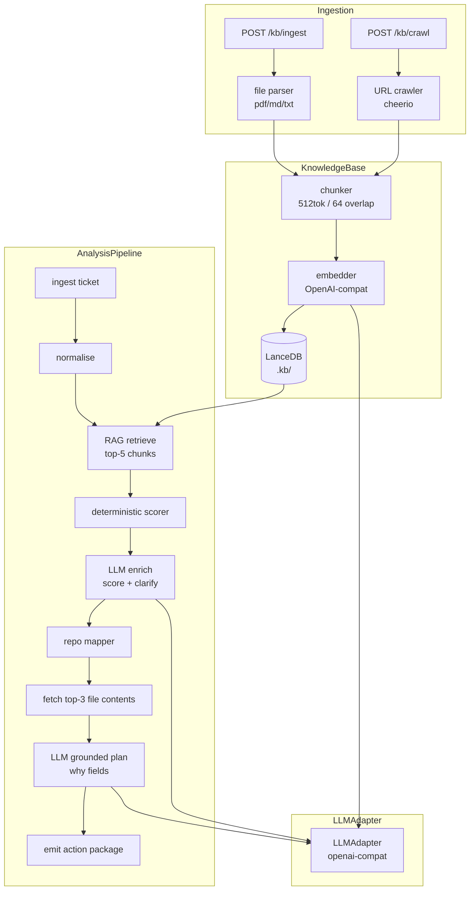
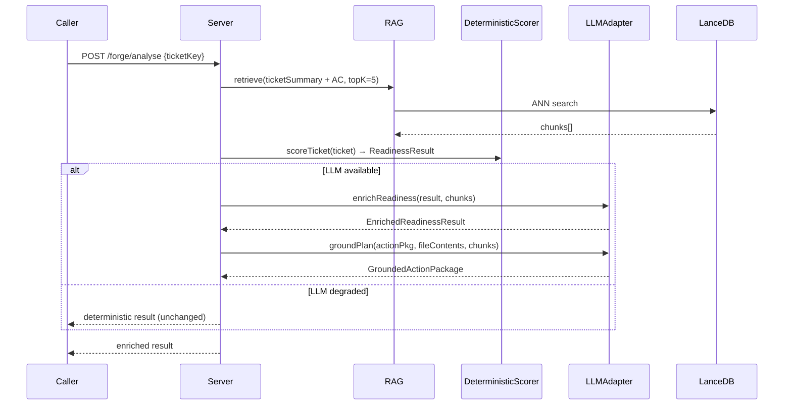

## Context

`product-overlord` today is a deterministic rule-engine: readiness scoring is a weighted keyword check, component mapping is a cosine-like string similarity, and clarification questions are templated strings. This produces consistent, testable output but lacks semantic depth — it cannot understand "the login flow should use the existing `AuthService`" unless `AuthService` appears as an exact keyword, and it cannot answer *why* a component is relevant with real justification.

Adding an LLM enrichment layer and a knowledge base (KT docs + code content) closes this gap without breaking the deterministic foundation.

**Current pipeline:**
```
ingest → normalise → [deterministic score] → [heuristic map] → plan → emit
```

**Target pipeline:**
```
ingest → normalise → [RAG retrieve chunks] → [deterministic score] → [LLM enrich] → [LLM-grounded map] → plan → emit
```

The deterministic score always runs first and is always present in the output. The LLM enrichment is an additive pass that can only *add* missing items or *raise* confidence — it cannot override a `blocked` verdict caused by open dependencies.

## Goals / Non-Goals

**Goals:**
- Pluggable LLM adapter (OpenAI-compatible; works with OpenAI, Azure OpenAI, Ollama)
- KT document ingestion: PDF, Markdown, plain text via file upload; HTML via URL crawl
- GitHub file content fetching for mapper-selected files (top-K by confidence)
- Vector store (LanceDB, embedded, no infra) for KT chunks and code chunks
- RAG retrieval at analysis time: top-K chunks injected into LLM scorer and planner prompts
- LLM enrichment of readiness output: richer missing-item descriptions, justified clarification questions
- LLM `why` field for each candidate component/file in the action package
- Full degraded-mode fallback: if `LLM_API_KEY` absent or LLM errors, deterministic result returned unchanged
- All new behaviour behind `DEGRADED_LLM=true` so existing 236 tests pass unchanged

**Non-Goals:**
- No real-time streaming responses
- No fine-tuning or embeddings training
- No cloud vector DB (LanceDB embedded only for now)
- No LLM inside the hot scoring path (deterministic score is synchronous and must stay so)
- No autonomous Jira writes — human gate unchanged
- No changes to Forge endpoint contracts visible to callers

## Decisions

### D1: LanceDB as vector store

**Decision:** Use `vectordb` (LanceDB Node.js binding) — embedded, file-system persisted, no daemon.

**Alternatives considered:**
- `chromadb` — requires a running server process, adds infra complexity
- `pgvector` — requires PostgreSQL, far too heavy for this use case
- In-memory cosine search — doesn't persist across restarts; adequate for tests only

**Rationale:** LanceDB stores to a local directory (`KB_STORE_PATH`, default `./.kb`), zero infra, Apache Arrow columnar format, fast ANN search. Matches the project's "no infra by default" principle.

### D2: Embeddings via `openai` SDK text-embedding model, not local transformer

**Decision:** Use the same OpenAI-compatible endpoint for both embeddings and chat completions.

**Alternatives considered:**
- `@xenova/transformers` (local model) — no network dependency but adds ~150 MB model download, slow on first run, complex WASM setup in Node
- Separate embedding provider — adds another API key and config surface

**Rationale:** Single `LLM_BASE_URL` + `LLM_API_KEY` covers both. Ollama users get both for free. Reduces config burden.

### D3: LLM enrichment is a post-hoc additive pass, not a replacement scorer

**Decision:** Run `enrichReadiness(deterministicResult, retrievedChunks): EnrichedResult` after the deterministic scorer. It may add items to `missing_items`, add questions, and add justification strings. It cannot change `readiness_status` from `blocked` to anything else.

**Rationale:** Keeps the deterministic scorer as the source of truth for verdict. LLM output is advisory and traceable. Preserves testability — mock LLM in tests, assert deterministic layer unchanged.

### D4: Prompt registry as plain TypeScript template literals, not external files

**Decision:** Prompts live in `src/llm/prompts.ts` as exported template functions `(context) => string`.

**Alternatives considered:**
- External `.prompt` files loaded at runtime — adds file-system reads and hot-reload complexity
- LangChain PromptTemplate — adds a large dep with many transitive deps

**Rationale:** TypeScript template literals are type-safe, testable, and version-controlled alongside code. No new abstraction layer needed.

### D5: File content fetching is lazy and bounded

**Decision:** After component mapping, fetch file contents for the top-3 highest-confidence files only, max 100 KB per file, truncated to 8 K tokens before embedding.

**Rationale:** Avoids fetching the entire repo. The mapper already identified the most relevant files; fetching all of them would exceed context windows and slow analysis. The 100 KB / 8 K token limit prevents prompt overflow.

### D6: Chunking strategy — 512-token overlapping windows

**Decision:** Chunk documents into 512-token windows with 64-token overlap. Metadata: `{source_id, chunk_index, source_type: "kt" | "code", file_path?, url?}`.

**Rationale:** 512 tokens is a well-established chunk size for retrieval quality. Overlap preserves sentence continuity across chunk boundaries.

## Architecture



## Sequence: Analysis with RAG + LLM enrichment



## Data model additions

```typescript
// src/llm/types.ts
interface LLMTrace {
  model: string;
  prompt_tokens: number;
  completion_tokens: number;
  latency_ms: number;
  degraded: boolean;
}

// added to EvidenceBundle
interface EvidenceBundle {
  // ...existing fields...
  llm_traces: LLMTrace[];
  retrieved_chunks: RetrievedChunk[];
}

interface RetrievedChunk {
  source_id: string;
  source_type: "kt" | "code";
  file_path?: string;
  url?: string;
  text: string;
  score: number; // cosine similarity
}
```

## Risks / Trade-offs

| Risk | Mitigation |
|---|---|
| LLM adds latency (1–5 s per call) | LLM runs after deterministic result is ready; UI can show deterministic result immediately and stream enrichment as a second pass |
| LLM hallucinates component names | LLM `why` fields are advisory text only; candidate component list is always generated by deterministic mapper first |
| LanceDB write concurrency | Single-writer design — KB ingestion is serialised via an async queue; reads are concurrent |
| Large KT uploads block the event loop | File parsing and chunking run in a worker thread via `node:worker_threads` |
| Embedding costs | `EMBEDDING_MODEL` defaults to `text-embedding-3-small` (cheapest); users can override to local Ollama model for zero cost |
| Test suite speed | All LLM calls are behind `DEGRADED_LLM=true` in CI; new LLM tests use a mock adapter |

## Migration Plan

1. Install new deps: `npm install openai lancedb pdf-parse cheerio`
2. Add env vars to `.env.example` and `src/server/config.ts`
3. New modules are additive — no existing file is deleted
4. Existing tests: set `DEGRADED_LLM=true` in `vitest.config.ts` (or `.env.test`)
5. New test suites added alongside existing ones
6. KB store dir (`.kb/`) added to `.gitignore`
7. Rollout: deploy with `DEGRADED_LLM=true` first; flip to `false` once KB is seeded with KT docs

## Open Questions

- OQ1: Should the KB support multi-tenancy (per-project namespacing in LanceDB)? Initial answer: yes — partition by `project_key` metadata field; retrieval filters on it.
- OQ2: Should crawled URLs be re-indexed on a schedule, or only on explicit POST? Initial answer: explicit only for now; scheduled re-crawl is a follow-on change.
- OQ3: Max KB store size guard? Propose 5 GB default, configurable via `KB_MAX_SIZE_GB` env.
