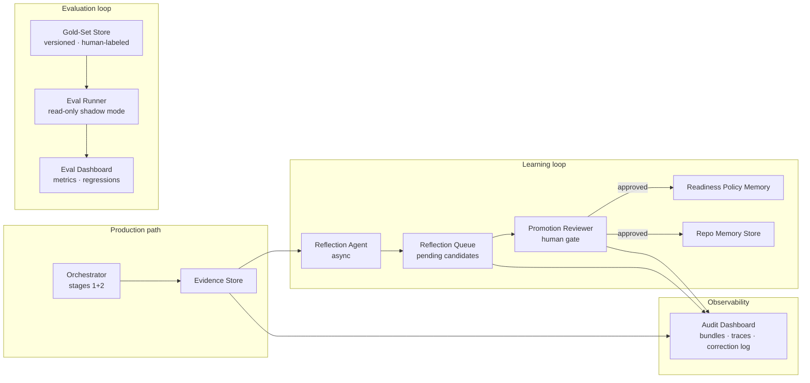
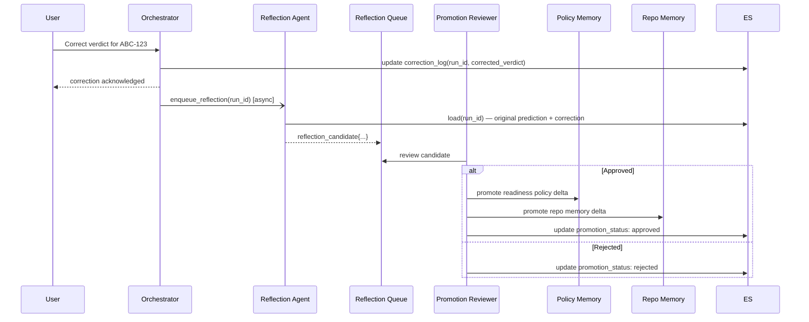

## Context

Stages 1 and 2 produce high-quality plans but have no feedback loop. Human corrections are lost, readiness policies drift, and there is no objective measure of plan quality. This design covers the gold-set evaluation framework, the Reflection Agent, the memory-promotion review workflow, shadow-mode replay, the audit dashboard, permission-boundary testing, and the optional deep-research subagent path.

## Goals / Non-Goals

**Goals:**
- Reproducible, versioned evaluation against human-labeled gold sets
- Structured reflection → human review → memory promotion pipeline
- Shadow-mode replay without production writes
- Audit dashboard for observability and debugging
- Permission-boundary test suite
- Isolated deep-research subagent (opt-in, rate-limited)

**Non-Goals:**
- Fully automated memory promotion without human review
- Forge embedding (stage 4)
- Changes to ingestion or repo-grounding logic (stages 1–2)

## System Architecture



## Reflection Sequence



## Component Contracts

### Gold-Set Entry Schema
```json
{
  "id": "gs-001",
  "prompt": "Analyse ABC-123",
  "issue_type": "story",
  "bucket": "needs_clarification",
  "expected_readiness_status": "needs_clarification",
  "expected_missing_dimensions": ["acceptance_criteria"],
  "expected_top_components": ["payments-api"],
  "expected_questions": ["What is the measurable success condition?"],
  "expected_manual_checks": ["Verify webhook idempotency key behaviour"],
  "tags": ["ac-alias", "repo-ambiguity"]
}
```

### Evaluation Metrics
| Metric | Target | Blocking |
|---|---|---|
| Readiness classification agreement | ≥ 85% | Yes |
| Component ranking precision-at-3 | ≥ 80% | Yes |
| Regression vs. previous run | < 5 pp drop | Yes |

### Reflection Candidate Schema
```json
{
  "candidate_id": "rc-uuid",
  "run_id": "run-uuid",
  "original_verdict": "needs_clarification",
  "corrected_verdict": "ready",
  "original_top_components": ["payments-api"],
  "actual_components": ["billing-service"],
  "evidence_delta": {},
  "suggested_policy_update": {},
  "suggested_repo_update": {},
  "status": "pending | approved | rejected",
  "reviewed_by": null,
  "reviewed_at": null
}
```

### Deep-Research Subagent
- Triggered only on explicit user request or `ambiguous` ticket flag
- Rate limit: 30 requests / user / day (calendar day UTC)
- Timeout: 15 minutes; on timeout emit `status: timeout` partial result
- Isolated context: separate MCP session, no shared state with operational subagent
- Results enter the standard evidence store but are tagged `source: deep-research`

## Audit Dashboard Data Model
Each run record exposes: `run_id`, `timestamp`, `trigger`, `verdict`, `score`, `adapter_traces[]`, `agent_outputs{}`, `correction_log[]`, `promotion_status`, `eval_run_id` (if part of shadow replay).

## Permission-Boundary Test Strategy
- Vary invoking credentials across project-A-only, project-B-only, cross-project, and read-only-repo tokens
- Assert zero cross-boundary data in: verdict text, evidence bundle, questions, repo candidates, comment draft
- Run as part of every evaluation suite and as a pre-promotion gate

## Failure Modes & Fallbacks

| Failure | Behaviour |
|---|---|
| Reflection Agent queue full | Drop oldest non-reviewed candidate; log warning |
| Promotion reviewer unavailable | Candidates remain pending; memory unchanged |
| Eval runner timeout | Mark run `partial`; report completed entries only |
| Deep-research timeout | Return `status: timeout` partial; never block primary path |
| Shadow replay Jira read error | Skip affected tickets; log in replay report |
