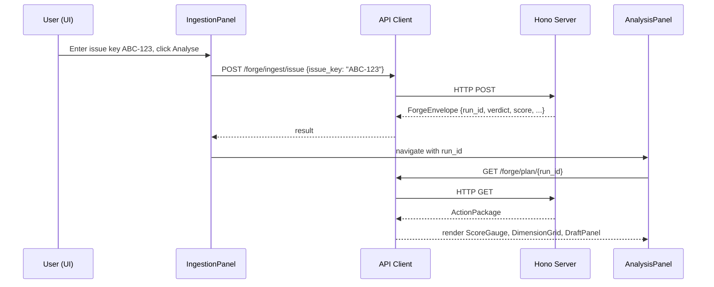
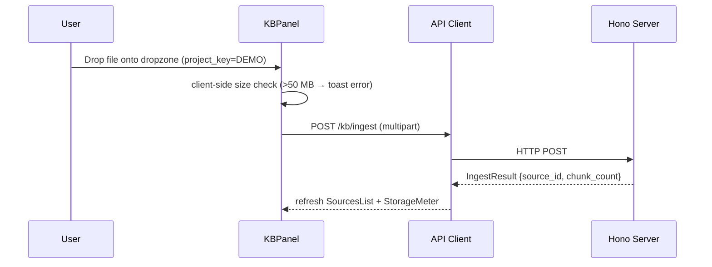

# Design: tauri-glass-ui

## Context

This design covers the Tauri 2 desktop shell, the glass design system, the React component hierarchy, the API client layer, and the wiring of each UI panel to the existing Hono backend. Backend business logic is untouched; the UI is a thin, reactive client.

## Goals / Non-Goals

**Goals:**
- macOS liquid-glass aesthetic with cross-platform graceful fallback
- Full coverage of all 17 product modules as interactive panels
- Typed API client over existing REST endpoints — no new backend logic
- Tauri sidecar that starts/stops the Hono server automatically
- Live log stream via SSE
- All 299 existing backend tests continue to pass

**Non-Goals:**
- New backend ingestion logic
- Mobile / web
- Multi-user / auth
- Offline mode

---

## System Architecture

```mermaid
flowchart TB
    subgraph Desktop ["Tauri 2 Desktop App (ui/)"]
        direction TB
        W[WebView — React 18 + Vite]
        subgraph Panels
            P1[Ingestion]
            P2[Readiness / Analysis]
            P3[Evidence Browser]
            P4[Draft Approval]
            P5[Planning]
            P6[Repo]
            P7[Knowledge Base]
            P8[LLM / RAG]
            P9[Eval]
            P10[Forge]
            P11[Log Console]
            P12[Test Runner]
            P13[Settings / Config]
            P14[Dev Tools]
        end
        AC[API Client\n@tanstack/react-query\ntyped fetch]
        TW[Tauri Core\nRust — window, sidecar, tray, updater]
    end

    subgraph Backend ["Hono Server (src/server/) — localhost:3000"]
        R1[/forge/* endpoints]
        R2[/kb/* endpoints]
        R3[/health]
        R4[/api/status  NEW]
        R5[/api/config  NEW]
        R6[/api/metrics SSE  NEW]
    end

    W --> AC
    AC -->|HTTP + SSE| Backend
    TW -->|sidecar spawn| Backend
    Panels --> W
```

---

## Glass Design System (`ui/src/theme/`)

All tokens are CSS custom properties set on `:root` and overridden by `[data-theme="dark"]`.

### Core tokens

```
--glass-bg:          rgba(255,255,255,0.55)   /* light */  / rgba(20,20,28,0.60) /* dark */
--glass-border:      rgba(255,255,255,0.35)   / rgba(255,255,255,0.10)
--glass-blur:        blur(24px) saturate(180%)
--glass-shadow:      0 8px 32px rgba(0,0,0,0.12)
--accent:            #0A84FF   /* macOS blue */
--accent-glow:       0 0 16px rgba(10,132,255,0.35)
--surface-1:         rgba(255,255,255,0.70)   / rgba(30,30,40,0.70)
--surface-2:         rgba(255,255,255,0.40)   / rgba(40,40,55,0.50)
--radius-panel:      16px
--radius-card:       12px
--radius-pill:       9999px
--spring-duration:   0.35s
--spring-easing:     cubic-bezier(0.34,1.56,0.64,1)
```

### Cross-platform fallback

- **macOS**: `backdrop-filter: blur(24px) saturate(180%)` — full glass.
- **Linux/Windows**: `backdrop-filter` supported in Chromium WebView; Tauri 2 uses system WebView — on Linux/Windows where WebView2/WebKitGTK supports it this works natively. Where unsupported, CSS `@supports` falls back to a solid `--surface-1` with reduced transparency.

### Component primitives (`ui/src/components/glass/`)

| Component | Description |
|---|---|
| `GlassPanel` | `div` with `backdrop-filter`, `--glass-bg`, `--glass-border`, `--glass-shadow`, `--radius-panel` |
| `GlassCard` | Smaller inset card; `--surface-2` background |
| `GlassButton` | Pill button; hover → accent glow; press → scale(0.97) spring |
| `GlassBadge` | Verdict / status pill; colour-coded (`ready`=green, `needs_clarification`=amber, `blocked`=red) |
| `GlassInput` | Frosted text input with floating label |
| `GlassModal` | Centred overlay with spring entrance animation |
| `GlassToast` | Bottom-right notification stack; auto-dismiss 4s |
| `ScoreGauge` | SVG arc gauge 0–100; animated via `framer-motion` |
| `LogConsole` | Virtualised `react-window` list; monospace; level colour bands |

---

## Component Hierarchy

```
App
├── TitleBar (custom draggable, traffic-light buttons)
├── Sidebar (icon nav, active panel highlight, spring slide)
└── MainContent
    ├── IngestionPanel
    │   ├── IssueKeyForm
    │   ├── JQLForm
    │   ├── AdapterTraceViewer
    │   └── LiveStatusBadge
    ├── AnalysisPanel
    │   ├── ScoreGauge
    │   ├── VerdictBadge
    │   ├── DimensionGrid (per-dimension pass/fail with weights)
    │   ├── MissingItemList (source: deterministic | llm)
    │   └── ClarificationQuestions (PM / Engineer / QA tabs)
    ├── NormaliserPanel
    │   └── CanonicalTicketInspector (field tree, AC alias highlight)
    ├── EvidencePanel
    │   ├── RunHistory (searchable table, run_id, verdict, score, timestamp)
    │   └── BundleDrillDown (full JSON tree, LLM traces, retrieved chunks)
    ├── DraftPanel
    │   ├── CommentPreview (rendered Markdown)
    │   └── ApproveDiscard (POST confirm_post_url | discard)
    ├── PlanningPanel
    │   ├── ActionPackageViewer
    │   ├── ComponentCandidateList (confidence bars)
    │   └── OpenSpecDiffPreview
    ├── RepoPanel
    │   ├── ComponentIndexBrowser (dossier cards)
    │   ├── MapperResultList
    │   └── TeamworkGraphStatus
    ├── KBPanel
    │   ├── FileUploadDropzone (drag-and-drop, 50 MB guard)
    │   ├── CrawlURLForm (depth selector)
    │   ├── SourcesList (project filter, delete button)
    │   └── StorageMeter (used / max GB)
    ├── LLMPanel
    │   ├── AdapterStatusBadge (live / degraded)
    │   ├── RateLimitGauge
    │   └── LLMTraceList
    ├── RAGPanel
    │   ├── RetrievedChunksViewer
    │   ├── ContextBlockPreview
    │   └── LatencyHistogram
    ├── EvalPanel
    │   ├── GoldSetBrowser (filterable by tag/bucket)
    │   ├── RunEvalButton
    │   ├── MetricsGrid (agreement %, precision@3, degraded rate)
    │   └── RolloutGateStatus
    ├── ForgePanel
    │   ├── EndpointHealthGrid
    │   ├── PayloadSizeMonitor
    │   └── CSRFTokenStatus
    ├── LogConsole
    │   ├── LevelFilter (debug/info/warn/error)
    │   ├── SearchBox
    │   └── VirtualisedLogList
    ├── TestRunnerPanel
    │   ├── SuiteSelector
    │   ├── RunButton
    │   ├── LiveOutputStream
    │   └── SummaryBadges (passed / failed / skipped)
    ├── SettingsPanel
    │   ├── EnvVarEditor (JIRA_*, GITHUB_*, LLM_*, KB_*)
    │   ├── DegradedModeToggles
    │   ├── PortConfig
    │   └── ServerStartStop
    └── DevToolsPanel
        ├── TypeExplorer
        └── UtilsLiveStats (retry histogram, latency p95, confidence histogram)
```

---

## API Client (`ui/src/api/`)

All calls go through a typed `apiFetch<T>(path, options)` wrapper that:
1. Reads the server URL from Zustand `settingsStore` (default `http://localhost:3000`).
2. Attaches `Authorization: Bearer <token>` if set.
3. Returns typed `Result<T, APIError>`.

React Query (`@tanstack/react-query`) is used for all GET calls with appropriate stale times. Mutations use `useMutation` with optimistic updates.

### SSE stream (`/api/metrics`)

```typescript
// ui/src/api/useMetricsStream.ts
export function useMetricsStream() {
  // EventSource → zustand logStore.append()
}
```

---

## New Backend Endpoints

Three read-only endpoints added to `src/server/app.ts`, gated behind `UI_DEV_ENDPOINTS=true` (default `true` in development, `false` in production unless explicitly set):

| Method | Path | Response |
|---|---|---|
| `GET` | `/api/status` | `{ server: "up", version, shadow_mode, degraded_flags, uptime_ms }` |
| `GET` | `/api/config` | Sanitised config — all credential fields redacted to `"[set]"` or `"[not set]"` |
| `GET` | `/api/metrics` | SSE stream of `ForgeInstrumentation` events + LLM call events + RAG retrieval events |

---

## Tauri Sidecar

`src-tauri/src/main.rs` spawns the Hono server as a Tauri sidecar:

```
binaries/
  product-overlord-server-x86_64-apple-darwin
  product-overlord-server-x86_64-unknown-linux-gnu
  product-overlord-server-x86_64-pc-windows-msvc
```

The sidecar is built by `npm run build:server` (esbuild bundle of `src/index.ts`) and embedded in the Tauri bundle. On app close, SIGTERM is sent to the sidecar.

---

## Sequence: Ticket Analysis Flow (UI)



---

## Sequence: KB Ingestion (UI)



---

## State Management

| Store (Zustand) | Contents |
|---|---|
| `settingsStore` | server URL, port, auth token, degraded flags |
| `analysisStore` | current run_id, verdict, score, dimensions, missing items, questions |
| `evidenceStore` | run history list, selected bundle |
| `kbStore` | sources list, storage used |
| `logStore` | circular buffer of last 2 000 log entries |
| `evalStore` | gold-set entries, last eval run, metrics |

---

## File Layout

```
ui/
  src-tauri/
    Cargo.toml
    tauri.conf.json          # allowlist: sidecar, shell, window
    src/
      main.rs                # sidecar spawn, system tray, auto-update
  src/
    main.tsx                 # React entry
    App.tsx                  # Router + QueryClientProvider + ThemeProvider
    theme/
      tokens.css             # CSS custom properties
      glass.css              # backdrop-filter utilities
    components/
      glass/                 # GlassPanel, GlassCard, GlassButton, …
      charts/                # ScoreGauge, LatencyHistogram, RateLimitGauge
      layout/                # Sidebar, TitleBar, MainContent
    panels/                  # One file per panel (17 panels)
    api/
      client.ts              # apiFetch wrapper
      useMetricsStream.ts    # SSE hook
      queries/               # Per-module React Query hooks
    stores/                  # Zustand stores
    types/                   # Mirrored TypeScript types from src/types/
  index.html
  vite.config.ts
  tailwind.config.ts
  package.json
```
