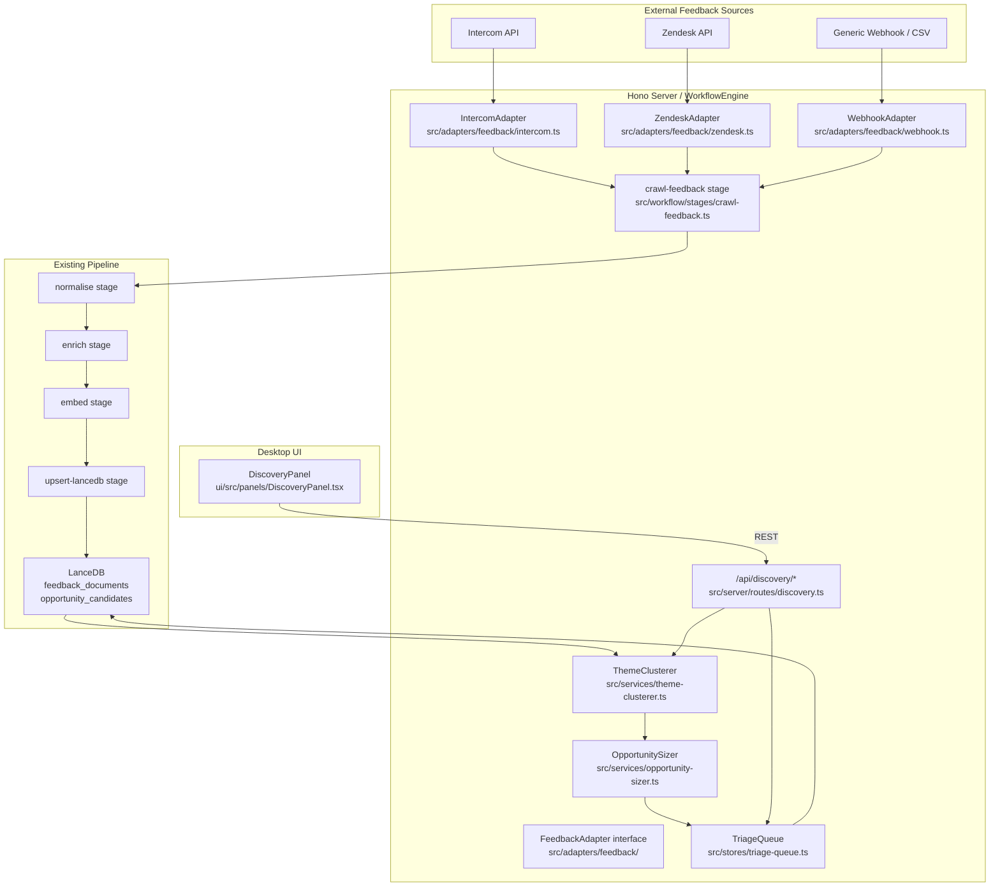

# Design: discovery-intake

## Context

The existing `WorkflowEngine` runs a linear pipeline: `crawl-docs → crawl-jira → crawl-github → normalise → enrich → embed → upsert-lancedb`. The `crawler.ts` adapter pattern already knows how to fetch, chunk, and hand off documents to the `normalise` stage. This change adds a `crawl-feedback` stage inserted before `normalise`, with pluggable `FeedbackAdapter` implementations for Intercom and Zendesk. Theme clustering and opportunity sizing run after embedding, treating `FeedbackDocument` records as a new document type in LanceDB. Opportunity candidates are promoted to draft Jira tickets by a human triage action — no autonomous ticket creation.

## Goals / Non-Goals

**Goals:**
- Pluggable feedback source adapters (Intercom, Zendesk, generic webhook/CSV)
- `crawl-feedback` stage integrated into existing `WorkflowEngine`
- Theme clustering using LLM + embedding similarity
- Opportunity sizing using RICE Reach/Impact proxies from feedback signal
- Human triage queue with promote-to-ticket action
- Zero autonomous Jira ticket creation

**Non-Goals:**
- Conducting NPS surveys or user interviews
- CRM-native two-way sync
- App store review or social media monitoring
- Deduplication with existing tickets (handled by existing normalise stage)

---

## System Architecture



---

## Data Model (`src/types/discovery.ts`)

```typescript
interface FeedbackDocument {
  id:               string;         // UUID
  source:           string;         // adapter name: 'intercom' | 'zendesk' | 'webhook'
  source_id:        string;         // native ID in the source system
  text:             string;         // cleaned feedback text
  sentiment_score:  number;         // -1.0 to 1.0 (LLM-assigned in enrich stage)
  created_at:       string;
  customer_segment: string | null;  // optional; from source metadata
  tags:             string[];
  theme_id:         string | null;  // set after clustering
}

interface FeedbackTheme {
  id:               string;
  name:             string;         // LLM-generated; human-editable
  document_ids:     string[];
  frequency:        number;
  avg_sentiment:    number;
  representative_quotes: string[];  // top 3 most representative texts
  created_at:       string;
  updated_at:       string;
}

interface OpportunityCandidate {
  id:              string;
  theme_id:        string;
  title:           string;          // LLM-generated draft title
  problem_statement: string;        // LLM-generated draft
  estimated_reach: number;          // document_ids.length (theme frequency proxy)
  estimated_impact: number;         // derived from avg_sentiment magnitude
  status:          'pending' | 'promoted' | 'dismissed';
  promoted_ticket_key: string | null;  // set after promotion
  created_at:      string;
}
```

---

## Pipeline Stage: `crawl-feedback` (`src/workflow/stages/crawl-feedback.ts`)

Inserted into `WorkflowEngine` as the first stage (before `crawl-docs`), activated only when at least one `FeedbackAdapter` is configured:

1. Iterate configured adapters from `ConnectionManager.feedbackAdapters`
2. Call `adapter.fetch({ since: lastSyncTimestamp })` → `RawFeedbackItem[]`
3. Deduplicate by `source + source_id` against `LanceDB.feedback_documents`
4. Emit each new item as a `CrawlDocument` with `doc_type: 'feedback'` into the existing pipeline normaliser
5. Update `lastSyncTimestamp` in `ConnectionManager` state on completion

### `FeedbackAdapter` interface

```typescript
interface FeedbackAdapter {
  name: string;
  fetch(opts: { since: string | null }): Promise<RawFeedbackItem[]>;
}

interface RawFeedbackItem {
  source_id:        string;
  text:             string;
  created_at:       string;
  customer_segment?: string;
  tags?:            string[];
}
```

### `IntercomAdapter` (`src/adapters/feedback/intercom.ts`)

- Uses Intercom REST API `GET /conversations?tag_id={bug|feature-request}&created_after={since}`
- Extracts conversation body text; strips HTML; trims to 2000 chars
- Maps `tags` from conversation labels

### `ZendeskAdapter` (`src/adapters/feedback/zendesk.ts`)

- Uses Zendesk REST API `GET /search?query=type:ticket tags:{configured_tags} created_after:{since}`
- Extracts ticket subject + description body
- Maps `customer_segment` from Zendesk organization custom field if configured

### `WebhookAdapter` (`src/adapters/feedback/webhook.ts`)

- Registers as `POST /api/discovery/ingest` 
- Accepts `{ source: string, text: string, created_at: string, metadata?: object }`
- Validates Bearer token; enqueues directly to `crawl-feedback` buffer

---

## Service Design

### `ThemeClusterer` (`src/services/theme-clusterer.ts`)

1. Queries LanceDB for all `FeedbackDocument` records with `theme_id = null`
2. Computes pairwise embedding similarity (cosine) — clusters via a simple k-means with `k = sqrt(N/2)` up to k=20
3. For each cluster: LLM prompt "Give a short 3–5 word theme name for these feedback items: {top 5 texts}"
4. Assigns `theme_id` to each document in cluster
5. Creates `FeedbackTheme` records with `representative_quotes` = top 3 texts closest to centroid
6. Triggered on: `POST /api/discovery/sync` after `crawl-feedback` completes, or manual `POST /api/discovery/recluster`

### `OpportunitySizer` (`src/services/opportunity-sizer.ts`)

- Runs after `ThemeClusterer` for each new or updated theme
- `estimated_reach = theme.frequency` (count of documents in theme)
- `estimated_impact = Math.abs(theme.avg_sentiment) * 10` (sentiment magnitude as 0–10 impact proxy)
- LLM prompt: "Draft a one-sentence problem statement for a product team based on this user feedback theme: {theme.name}, representative quotes: {top 3}. Return JSON: { title: string, problem_statement: string }"
- Creates `OpportunityCandidate` with `status: 'pending'` → saved to LanceDB

### `TriageQueue` (`src/stores/triage-queue.ts`)

- Reads `OpportunityCandidate` records from LanceDB with `status = 'pending'`
- `promote(id, humanReview)`: validates `status = 'pending'`, calls `jira-agile-rest.CreateIssue()` with draft title + problem statement in description; sets `status = 'promoted'` and `promoted_ticket_key`
- `dismiss(id, reason)`: sets `status = 'dismissed'`; reason stored for future training

---

## API Routes (`src/server/routes/discovery.ts`)

| Method | Path | Description |
|--------|------|-------------|
| POST | `/api/discovery/sync` | Trigger full feedback sync + recluster |
| POST | `/api/discovery/ingest` | Generic webhook ingest |
| GET | `/api/discovery/themes` | List `FeedbackTheme[]` with stats |
| GET | `/api/discovery/themes/:id` | Theme detail with document list |
| PATCH | `/api/discovery/themes/:id` | Rename theme / merge into another |
| GET | `/api/discovery/candidates` | List `OpportunityCandidate[]` with `status=pending` |
| POST | `/api/discovery/candidates/:id/promote` | Human-confirmed promote to Jira ticket |
| POST | `/api/discovery/candidates/:id/dismiss` | Dismiss candidate with reason |
| POST | `/api/discovery/recluster` | Re-run clustering on all feedback documents |

---

## UI: `DiscoveryPanel` (`ui/src/panels/DiscoveryPanel.tsx`)

**Theme Cards Tab**
- Grid of `GlassCard` per theme: name, frequency badge, average sentiment indicator (green/amber/red)
- Expand card → representative quotes + linked opportunity candidate
- "Rename Theme" inline input; "Merge into…" dropdown

**Triage Queue Tab**
- List of `OpportunityCandidate` cards with: title, problem statement, estimated reach, estimated impact
- "Promote to Ticket" button → `GlassModal` showing draft Jira ticket fields (editable title + description) + "Confirm & Create in Jira" button
- "Dismiss" button → `GlassModal` asking for dismiss reason

**Sentiment Timeline Tab**
- Line chart (per-week average sentiment across all themes, or filtered by theme)
- Date range selector

---

## State: `discoveryStore` (Zustand)

```typescript
interface DiscoveryStore {
  themes:       FeedbackTheme[];
  candidates:   OpportunityCandidate[];
  syncing:      boolean;
  setThemes:    (themes: FeedbackTheme[]) => void;
  setCandidates:(candidates: OpportunityCandidate[]) => void;
  setSyncing:   (b: boolean) => void;
}
```

---

## Error Handling

- Intercom/Zendesk API unavailable: log `adapter_degraded: {name}`; continue with other adapters; partial sync noted in sync result
- Clustering with < 5 documents: skip clustering; return `{ warnings: ['too_few_documents_to_cluster'] }`
- LLM timeout during theme naming: theme created with name `"Unnamed Theme {n}"`; human must rename
- Jira ticket creation failure on promote: return `502` with Jira error; candidate stays `pending`; human can retry

---

## Testing Strategy

- Unit: `IntercomAdapter` (mocked HTTP, tag filtering, HTML stripping, since parameter)
- Unit: `ZendeskAdapter` (mocked HTTP, organisation segment mapping)
- Unit: `ThemeClusterer` (k-means with fixture embeddings, LLM theme naming)
- Unit: `OpportunitySizer` (reach/impact formulas, LLM problem statement generation)
- Unit: `TriageQueue` (promote creates Jira ticket, dismiss records reason)
- Integration: `crawl-feedback` stage in `WorkflowEngine` pipeline with mocked Intercom
- Contract: all 9 API routes
- UI: `DiscoveryPanel` — theme cards, triage queue promote/dismiss flows, empty state
