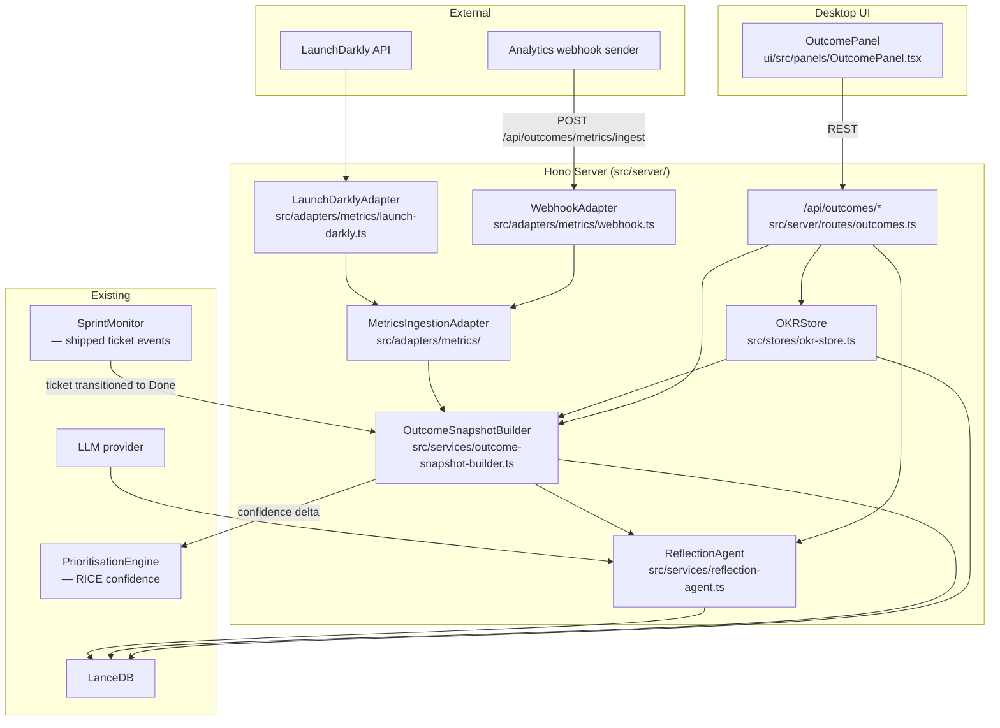

# Design: outcome-tracking

## Context

The current pipeline ends when a ticket ships. There is no model for what success looks like after shipping. This change introduces `OKR` records that can be linked to epics, a `MetricsIngestionAdapter` interface for consuming metric signals (LaunchDarkly feature flags, generic analytics webhooks), a `ReflectionAgent` that compares shipped acceptance criteria against actual metrics, and an `OutcomePanel` that surfaces all of this in the desktop UI. The `PrioritisationEngine` from roadmap-planning is extended to consume outcome signals as a confidence feedback mechanism.

## Goals / Non-Goals

**Goals:**
- OKR CRUD with linkage to epics and milestones
- Metrics ingestion via LaunchDarkly adapter and generic webhook
- Post-ship `OutcomeSnapshot` per epic with OKR progress, flag adoption, and reflection notes
- LLM-powered `ReflectionAgent` drafts (human-reviewed)
- Feedback loop: outcome signal → RICE confidence boost/decay in `PrioritisationEngine`

**Non-Goals:**
- Autonomous OKR grading
- Raw analytics event storage
- NPS survey collection (consumed from discovery-intake, not owned here)
- Financial attribution

---

## System Architecture



---

## Data Model (`src/types/outcomes.ts`)

```typescript
interface OKR {
  id:           string;        // UUID
  objective:    string;
  quarter:      string;        // e.g. "Q3-2026"
  key_results:  KeyResult[];
  linked_epic_keys: string[];
  owner:        string;
  created_at:   string;
  updated_at:   string;
}

interface KeyResult {
  id:        string;
  title:     string;
  target:    number;
  current:   number;
  unit:      string;       // e.g. "%" | "users" | "ms" | "NPS points"
  direction: 'increase' | 'decrease' | 'maintain';
  source:    'manual' | 'launchdarkly' | 'webhook';
}

interface MetricEvent {
  source:       string;          // adapter name
  metric_name:  string;
  value:        number;
  timestamp:    string;
  dimensions:   Record<string, string>;
}

interface OutcomeSnapshot {
  id:              string;
  epic_key:        string;
  snapshot_date:   string;
  shipped_date:    string | null;
  okr_deltas:      OKRDelta[];
  flag_adoption:   FlagAdoption[];
  reflection_draft: string | null;     // LLM-generated Markdown
  reflection_notes: string | null;     // human-edited notes
  status:          'draft' | 'reviewed';
}

interface OKRDelta {
  okr_id:         string;
  kr_id:          string;
  before:         number;
  after:          number;
  delta:          number;
  measured_at:    string;
}

interface FlagAdoption {
  flag_key:       string;
  flag_name:      string;
  evaluations_7d: number;
  on_percentage:  number;
  trend:          number[];      // last 7 days daily eval count
}
```

---

## Service Design

### `MetricsIngestionAdapter` interface (`src/adapters/metrics/index.ts`)

```typescript
interface MetricsIngestionAdapter {
  name: string;
  fetchMetrics(epicKey: string): Promise<MetricEvent[]>;
}
```

### `LaunchDarklyAdapter` (`src/adapters/metrics/launch-darkly.ts`)

- On `fetchMetrics(epicKey)`: queries LaunchDarkly REST API for flags tagged with `epic:{epicKey}` or from configured flag keys in `ConnectionManager.LaunchDarklyConfig`
- Returns `MetricEvent[]` with `metric_name = flag_key`, `value = on_percentage`, `dimensions = { env, flag_state }`
- Also fetches 7-day evaluation count timeseries for sparkline

### `WebhookAdapter` (`src/adapters/metrics/webhook.ts`)

- Registers as `POST /api/outcomes/metrics/ingest` handler
- Validates Bearer token against `ConnectionManager.webhookSecret`
- Persists raw `MetricEvent` to LanceDB table `metric_events` (keyed by `source + metric_name + timestamp`)
- On ingest: checks if `dimensions.epic_key` maps to a known OKR key result → updates `KeyResult.current`

### `OutcomeSnapshotBuilder` (`src/services/outcome-snapshot-builder.ts`)

- Triggered by: `SprintMonitor` `ticket:done` event (when a ticket in a tracked epic transitions to Done), or `POST /api/outcomes/:epicKey/snapshot`
- Checks if all child tickets of the epic are Done → if so, marks epic as "shipped"
- Calls `LaunchDarklyAdapter.fetchMetrics(epicKey)` and reads buffered `WebhookAdapter` events for the epic
- Computes `OKRDelta[]` for all linked OKRs by comparing `KeyResult.current` before and after ship date
- Calls `ReflectionAgent.draft(epic, snapshot)` → stores `reflection_draft` as Markdown
- Saves `OutcomeSnapshot` to LanceDB table `outcome_snapshots`
- Emits confidence delta to `PrioritisationEngine`: if `okr_deltas` are positive → boost RICE confidence by up to 10%; if negative → decay by up to 15%

### `ReflectionAgent` (`src/services/reflection-agent.ts`)

- LLM prompt: "Given acceptance criteria: {ac}, and measured outcomes: {okr_deltas + flag_adoption}, what did we learn? Draft a post-ship reflection covering: outcome vs. expectation, contributing factors, and next steps."
- Returns Markdown string stored in `OutcomeSnapshot.reflection_draft`
- Draft is human-editable in the UI; `status` flips to `reviewed` when PM saves notes

---

## API Routes (`src/server/routes/outcomes.ts`)

| Method | Path | Description |
|--------|------|-------------|
| POST | `/api/outcomes/okrs` | Create OKR |
| GET | `/api/outcomes/okrs` | List all OKRs |
| GET | `/api/outcomes/okrs/:id` | Get OKR detail |
| PATCH | `/api/outcomes/okrs/:id` | Update OKR / key results |
| DELETE | `/api/outcomes/okrs/:id` | Delete OKR |
| POST | `/api/outcomes/:epicKey/snapshot` | Trigger outcome snapshot |
| GET | `/api/outcomes/:epicKey/snapshot` | Get latest snapshot |
| PATCH | `/api/outcomes/:epicKey/snapshot/notes` | Save PM reflection notes |
| POST | `/api/outcomes/metrics/ingest` | Generic metrics webhook |

---

## UI: `OutcomePanel` (`ui/src/panels/OutcomePanel.tsx`)

**OKR Tab**
- List of OKRs with progress bars per key result (`current / target`)
- "Add OKR" button → inline form; "Link to Epic" multi-select
- Quarter filter dropdown

**Outcome Snapshot Tab**
- Epic selector → shows `OutcomeSnapshot` for selected epic
- OKR delta cards: before / after / delta
- Feature flag adoption sparklines (7-day trend per flag)
- Reflection card: `GlassCard` with `reflection_draft` in read mode; "Edit Reflection Notes" toggles a `<textarea>`; Save calls `PATCH .../snapshot/notes`

---

## State: `outcomeStore` (Zustand)

```typescript
interface OutcomeStore {
  okrs:       OKR[];
  snapshots:  Map<string, OutcomeSnapshot>;
  setOKRs:    (okrs: OKR[]) => void;
  setSnapshot:(epicKey: string, snap: OutcomeSnapshot) => void;
  updateNotes:(epicKey: string, notes: string) => void;
}
```

---

## Error Handling

- LaunchDarkly API unavailable: snapshot generated without `flag_adoption`; `FlagAdoption[]` is empty; `warnings: ['launchdarkly_unavailable']` in snapshot
- No OKRs linked to epic: snapshot still generated with empty `okr_deltas`; UI shows advisory "Link OKRs to this epic to track outcome progress"
- `ReflectionAgent` LLM failure: snapshot saved with `reflection_draft: null`; PM can manually fill in notes
- Webhook ingest with unknown epic key in dimensions: event stored to LanceDB but not linked to any OKR; surfaced in a "Unmatched Metrics" list in `OutcomePanel`

---

## Testing Strategy

- Unit: `LaunchDarklyAdapter` (mocked HTTP, flag tagging, 7-day timeseries)
- Unit: `WebhookAdapter` (auth validation, event parsing, OKR key result update)
- Unit: `OutcomeSnapshotBuilder` (epic completion detection, OKR delta calculation, confidence delta emission)
- Unit: `ReflectionAgent` (prompt construction, Markdown output parsing)
- Integration: full snapshot pipeline — `SprintMonitor` event → `OutcomeSnapshotBuilder` → `ReflectionAgent` → LanceDB
- Contract: all 9 API routes
- UI: `OutcomePanel` — OKR tab, snapshot tab with reflection editing, empty state
