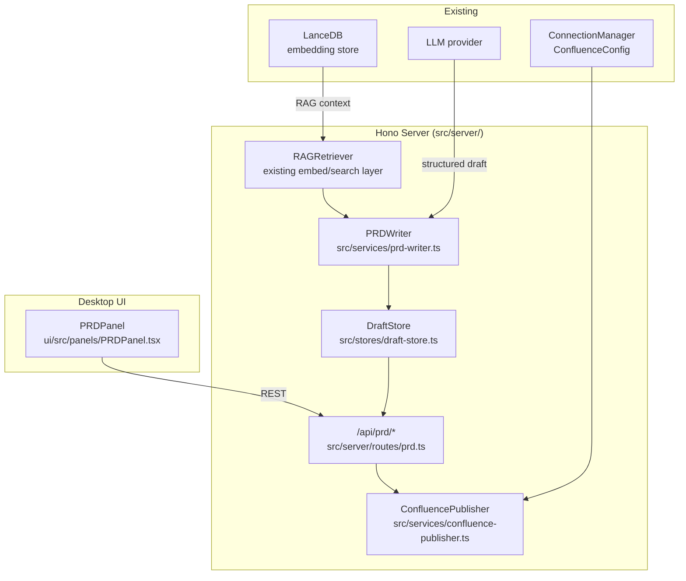

# Design: prd-generation

## Context

The system already holds rich enriched `CanonicalTicket` records with acceptance criteria, component mappings, repo confidence scores, and LLM-generated clarification questions stored in LanceDB. The LLM provider (configured via `LLMConfig`) supports structured JSON output. Confluence is already a known connection target in `ConnectionManager`. This change adds a `PRDWriter` service that retrieves this context via RAG, generates structured document drafts, presents them for human review in a new `PRDPanel`, and publishes to Confluence only after explicit human confirmation.

## Goals / Non-Goals

**Goals:**
- On-demand PRD, one-pager, and release-note generation from enriched ticket data
- RAG-grounded drafts using existing LanceDB embedding store
- Human-in-the-loop review and inline editing before any publish
- Diff view against existing Confluence page before overwrite
- Version history of all drafts per ticket

**Non-Goals:**
- Autonomous publishing without human confirmation
- Batch PRD generation across all tickets
- Generating content for tickets with readiness score < 0.4
- OKR success metrics in PRDs (those come from outcome-tracking)

---

## System Architecture



---

## Document Templates

Three templates, each defined as a TypeScript object in `src/services/prd-writer.ts`:

### PRD Template
```
1. Problem Statement
2. Goals & Success Criteria
3. Non-Goals
4. User Stories (from acceptance_criteria field)
5. Functional Requirements
6. Technical Considerations (from repo confidence + component mapping)
7. Open Questions (from clarification_questions)
8. Risks & Mitigations
9. Release Criteria
```

### One-Pager Template
```
1. Problem
2. Proposed Solution
3. Target Users
4. Success Metrics (placeholder — human fills in)
5. Key Risks
```

### Release Note Template
```
1. What Shipped (summary)
2. What Changed (bullet list from acceptance_criteria)
3. Affected Components (from component_mapping)
4. Known Issues (from open blockers at ship time)
5. Rollback Instructions (from repo understanding context)
```

---

## Data Model (`src/types/prd.ts`)

```typescript
type DocumentType = 'prd' | 'one-pager' | 'release-note';

interface PRDDraft {
  id:            string;          // UUID
  ticket_key:    string;
  document_type: DocumentType;
  version:       number;          // increments on each regeneration
  content:       PRDContent;
  created_at:    string;
  updated_at:    string;
  status:        'draft' | 'approved' | 'published';
  confluence_url: string | null;  // set after publish
  rag_sources:   RAGSource[];     // which LanceDB documents informed the draft
}

interface PRDContent {
  sections: PRDSection[];   // ordered list matching the template
}

interface PRDSection {
  heading: string;
  body:    string;   // Markdown
}

interface RAGSource {
  doc_id:    string;
  title:     string;
  score:     number;
  source_type: 'ticket' | 'confluence' | 'repo-file';
}
```

---

## Service Design

### `PRDWriter` (`src/services/prd-writer.ts`)

1. **Guard check**: if `ticket.readiness_score < 0.4` → reject with `{ error: 'readiness_too_low', current_score: X, threshold: 0.4 }`
2. **RAG retrieval**: embed the ticket summary → query LanceDB top-10 similar documents (tickets + confluence pages + repo files)
3. **Context assembly**: build LLM prompt with: ticket fields (summary, description, acceptance_criteria, component_mapping, clarification_questions), RAG hits, and selected template structure
4. **LLM call**: `llm.generate({ schema: PRDContentSchema, prompt })` in JSON mode — each section is a key in the structured response
5. **Draft storage**: `DraftStore.save(draft)` → persisted to LanceDB table `prd_drafts`
6. **Return**: `PRDDraft` with `status: 'draft'`

### `ConfluencePublisher` (`src/services/confluence-publisher.ts`)

- `publish(draft, config)`:
  1. Converts `PRDContent` sections to Confluence Storage Format (XHTML) or Confluence wiki markup
  2. If `confluence_url` is set on the draft: fetches existing page, constructs diff, returns `{ diff, page_title, space_key, parent_id }` for UI display before committing
  3. On confirmed publish: `PUT /wiki/rest/api/content/{pageId}` (update) or `POST /wiki/rest/api/content` (create)
  4. Sets `draft.status = 'published'` and `draft.confluence_url` in `DraftStore`
- Credentials and parent page config loaded from `ConnectionManager.ConfluenceConfig`

### `DraftStore` (`src/stores/draft-store.ts`)

- Persists to LanceDB table `prd_drafts` (non-vector table, JSON rows)
- `save(draft)`: upsert by `id`
- `getByTicket(ticketKey)`: list all drafts for a ticket, sorted by `version` descending
- `get(id)`: single draft by UUID
- `approve(id)`: sets `status = 'approved'`
- `markPublished(id, url)`: sets `status = 'published'` + `confluence_url`

---

## API Routes (`src/server/routes/prd.ts`)

| Method | Path | Description |
|--------|------|-------------|
| POST | `/api/prd/:ticketKey/draft` | Generate new draft; body: `{ document_type }` |
| GET | `/api/prd/:ticketKey/drafts` | List all drafts for ticket |
| GET | `/api/prd/:ticketKey/drafts/:id` | Get single draft |
| PATCH | `/api/prd/:ticketKey/drafts/:id` | Human inline edit (updates `content` + bumps `updated_at`) |
| POST | `/api/prd/:ticketKey/drafts/:id/approve` | Mark draft approved |
| GET | `/api/prd/:ticketKey/drafts/:id/diff` | Pre-publish Confluence diff |
| POST | `/api/prd/:ticketKey/drafts/:id/publish` | Human-confirmed publish to Confluence |

---

## UI: `PRDPanel` (`ui/src/panels/PRDPanel.tsx`)

**State A — No draft**
- Ticket key input + document type selector (PRD / One-pager / Release Note)
- "Generate Draft" button → `POST /api/prd/:key/draft`; shows spinner during LLM call

**State B — Draft ready**
- Section-by-section rich-text editor (`@uiw/react-md-editor` or plain `<textarea>` per section)
- RAG Sources sidebar: collapsible list of source documents with relevance scores
- "Approve" button → `POST /api/prd/.../approve`; unlocks Publish button

**State C — Approved, ready to publish**
- "Preview Confluence Diff" button → fetches `/api/prd/.../diff` and shows side-by-side diff in a `GlassModal`
- "Publish to Confluence" button inside modal — `POST /api/prd/.../publish`
- On success: shows `GlassToast` "Published to Confluence" with link

**Version history**: `GlassCard` list at bottom of panel; click any version to load it read-only

---

## State: `prdStore` (Zustand)

```typescript
interface PRDStore {
  draftsByTicket: Map<string, PRDDraft[]>;
  activeDraft:    PRDDraft | null;
  setDrafts:      (ticketKey: string, drafts: PRDDraft[]) => void;
  setActive:      (draft: PRDDraft) => void;
  updateSection:  (sectionIndex: number, body: string) => void;
}
```

---

## Error Handling

- Readiness guard (< 0.4): return `400 Bad Request` with structured error; UI shows advisory message with link to ticket's analysis panel
- LLM timeout / error: return `502` with `{ error: 'llm_unavailable' }`; no partial draft stored
- Confluence publish failure: return `502` with Confluence API error details; draft remains `approved` so human can retry
- RAG retrieval with 0 results: draft is generated with a warning comment in each section noting low grounding confidence

---

## Testing Strategy

- Unit: `PRDWriter` (readiness guard, template selection, LLM prompt construction, RAG context injection)
- Unit: `ConfluencePublisher` (diff generation with mock page, create vs. update branching)
- Unit: `DraftStore` (CRUD, version increment)
- Integration: full draft generation pipeline with mocked LLM + LanceDB
- Contract: all 7 API routes (happy path, readiness guard, edit, publish with diff)
- UI: `PRDPanel` in all three states (no draft, draft ready, approved); publish confirmation modal flow
