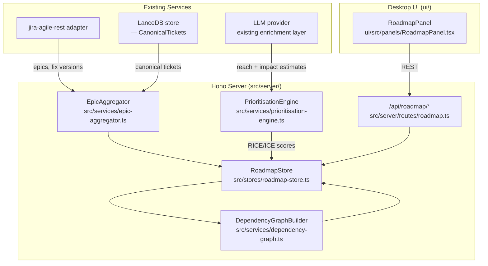

# Design: roadmap-planning

## Context

Individual tickets exist in isolation inside the current system. There is no epic, milestone, or quarter model. The Jira Agile REST adapter can already fetch epics per board (`GET /board/{boardId}/epic`), and `CanonicalTicket` records carry a `parent` field pointing to their epic. This change builds an aggregation and prioritisation layer on top of what is already ingested — introducing `Epic` and `Milestone` types, a `RoadmapStore`, RICE/ICE scoring, and a cross-epic dependency graph.

## Goals / Non-Goals

**Goals:**
- Model the epic → milestone → quarter hierarchy from existing Jira data
- Roll up child-ticket readiness scores into an epic health score
- RICE and ICE prioritisation scoring with LLM-enriched estimates
- Cross-epic dependency graph surfacing blockers across teams
- Quarterly roadmap timeline view in the desktop UI
- Zero Jira writes — all data derived from existing ingestion

**Non-Goals:**
- Automatically creating or modifying epics in Jira
- OKR linkage (outcome-tracking change)
- Cross-project portfolio view (portfolio-management change)
- Capacity planning or staffing

---

## System Architecture



---

## Data Model (`src/types/roadmap.ts`)

```typescript
interface Epic {
  key:              string;
  summary:          string;
  description:      string | null;
  status:           string;
  project_key:      string;
  milestone_id:     string | null;    // links to Milestone
  child_keys:       string[];         // CanonicalTicket keys
  linked_epic_keys: string[];         // cross-epic dependencies
  health_score:     number;           // 0–100, rolled up from children
  health_label:     'healthy' | 'at-risk' | 'blocked';
  rice_score:       RICEScore | null;
  ice_score:        ICEScore | null;
  created_at:       string;
  updated_at:       string;
}

interface Milestone {
  id:          string;              // UUID or Jira fix-version ID
  name:        string;
  target_date: string;             // ISO-8601 date
  quarter:     string;             // e.g. "Q3-2026"
  project_key: string;
  epic_keys:   string[];
  status:      'planned' | 'in-progress' | 'shipped' | 'delayed';
}

interface RICEScore {
  reach:       number;   // estimated users impacted (0–1000)
  impact:      number;   // 0.25 | 0.5 | 1 | 2 | 3
  confidence:  number;   // percentage 0–100
  effort:      number;   // person-weeks
  score:       number;   // reach * impact * confidence / effort
  estimated_by: 'llm' | 'human';
}

interface ICEScore {
  impact:      number;   // 1–10
  confidence:  number;   // 1–10
  ease:        number;   // 1–10
  score:       number;   // impact * confidence * ease
  estimated_by: 'llm' | 'human';
}

interface RoadmapSnapshot {
  project_key:  string;
  generated_at: string;
  milestones:   Milestone[];
  epics:        Epic[];
  dependency_graph: DependencyEdge[];
}

interface DependencyEdge {
  from_epic:   string;
  to_epic:     string;
  type:        'blocks' | 'depends-on';
  cross_team:  boolean;
}
```

---

## Service Design

### `EpicAggregator` (`src/services/epic-aggregator.ts`)

1. Fetches all epics for a project via `jira-agile-rest.GetEpicsForBoard(boardId)`
2. For each epic: loads child `CanonicalTicket` records from LanceDB by `parent.key === epic.key`
3. Aggregates `readiness_score` values: `health_score = mean(child.readiness_score) * 100`
4. Derives `health_label`:
   - `>= 70` → `healthy`
   - `>= 40` → `at-risk`
   - `< 40` → `blocked`
5. Extracts `linked_epic_keys` from child ticket `dependencies` that point to other epics (cross-epic links)
6. Maps Jira fix-version → `Milestone` (one milestone per fix-version per project)
7. Writes result to `RoadmapStore`

### `PrioritisationEngine` (`src/services/prioritisation-engine.ts`)

- Accepts an `Epic` record + optional PM-supplied overrides
- **RICE estimation (LLM-assisted)**:
  - `reach`: extracted from epic description keywords (LLM prompt: "Estimate how many users this feature affects on a scale 0–1000, given: {description}")
  - `impact`: extracted from labels (`critical`→3, `high`→2, `medium`→1, `low`→0.5, unlabelled→0.25)
  - `confidence`: derived from `health_score` (readiness proxy) — `health_score / 100 * 100`
  - `effort`: sum of child ticket `original_estimate` fields in person-weeks (1 person-week = 40 hours)
- **ICE estimation (LLM-assisted)**:
  - `impact` and `confidence` mapped from RICE values, normalised 1–10
  - `ease`: inverse of `effort` normalised to 1–10
- All LLM estimates are labelled `estimated_by: 'llm'`; PM overrides set `estimated_by: 'human'`
- Returns updated `Epic` with `rice_score` and `ice_score` fields

### `DependencyGraphBuilder` (`src/services/dependency-graph.ts`)

- Iterates all epics in `RoadmapStore` for a project
- For each epic's `linked_epic_keys`: creates a `DependencyEdge`
- Marks `cross_team: true` when `from_epic.project_key !== to_epic.project_key`
- Detects cycles (DFS) and flags them in the snapshot as `warnings`
- Returns `DependencyEdge[]`

### `RoadmapStore` (`src/stores/roadmap-store.ts`)

- In-process `Map<projectKey, RoadmapSnapshot>` cache
- `refresh(projectKey)`: triggers `EpicAggregator` → `PrioritisationEngine` → `DependencyGraphBuilder` pipeline
- Exposes `getSnapshot(projectKey)`, `updateEpicRICE(epicKey, overrides)`, `getMilestones(projectKey)`
- Persists last snapshot to LanceDB table `roadmap_snapshots` (keyed by `project_key + generated_at`)

---

## API Routes (`src/server/routes/roadmap.ts`)

| Method | Path | Description |
|--------|------|-------------|
| GET | `/api/roadmap/:projectKey` | Full `RoadmapSnapshot` |
| POST | `/api/roadmap/:projectKey/refresh` | Trigger re-aggregation |
| GET | `/api/roadmap/:projectKey/epics` | All epics with scores |
| GET | `/api/roadmap/:projectKey/epics/:epicKey` | Epic detail + child tickets |
| PATCH | `/api/roadmap/:projectKey/epics/:epicKey/rice` | Human RICE override |
| GET | `/api/roadmap/:projectKey/milestones` | All milestones |
| GET | `/api/roadmap/:projectKey/dependencies` | `DependencyEdge[]` |

---

## UI: `RoadmapPanel` (`ui/src/panels/RoadmapPanel.tsx`)

Three sub-views, switchable via tab bar:

**1. Timeline View**
- Horizontal swimlane per milestone/quarter
- Epics rendered as pill bars (width ∝ effort); colour coded by `health_label`
- Dependency arrows drawn with SVG between blocking epics
- Click on epic → side drawer with child ticket list and readiness scores

**2. RICE Table View**
- Sortable table: Epic | Reach | Impact | Confidence | Effort | RICE Score | Source (LLM/Human)
- Inline editable RICE fields; `PATCH /api/roadmap/…/rice` on blur
- Sort by RICE score descending by default

**3. Dependency Graph View**
- Force-directed SVG graph (D3 or `react-force-graph`)
- Cross-team edges highlighted in amber
- Cycle warnings shown as a red badge

---

## State: `roadmapStore` (Zustand)

```typescript
interface RoadmapStore {
  snapshots:       Map<string, RoadmapSnapshot>;
  selectedProject: string | null;
  setSnapshot:     (key: string, snap: RoadmapSnapshot) => void;
  selectProject:   (key: string) => void;
  updateRICE:      (epicKey: string, overrides: Partial<RICEScore>) => void;
}
```

---

## Error Handling

- If Jira returns no epics: return empty `RoadmapSnapshot` with `warnings: ['no_epics_found']`
- If LLM enrichment fails for an epic: RICE/ICE remain `null`; epic is still included in snapshot
- LanceDB persistence failure: log warning, serve from in-process cache — not a fatal error

---

## Testing Strategy

- Unit tests: `EpicAggregator` (3 fixture boards), `PrioritisationEngine` (RICE + ICE calculation parity), `DependencyGraphBuilder` (cycle detection, cross-team flag)
- Integration: full `RoadmapStore.refresh()` pipeline with mocked Jira adapter + LLM
- Contract tests: all API routes (happy path, empty project, RICE override persistence)
- UI tests: all three sub-views with mocked store (timeline, RICE table sort, dependency cycle warning)
