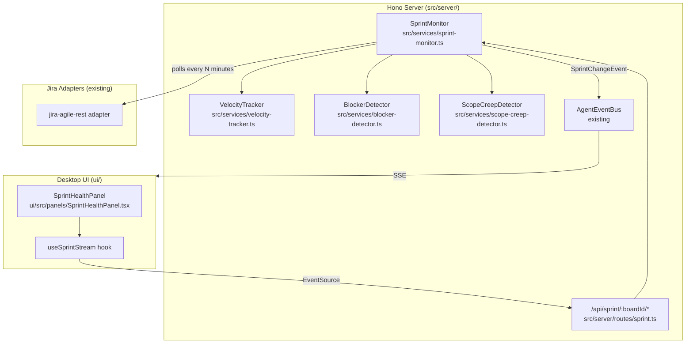

# Design: sprint-execution-visibility

## Context

The Jira ingestion pipeline already fetches board, sprint, and backlog data via `jira-agile-rest` during the `crawl-jira` stage. After ingestion that data is normalised into `CanonicalTicket` records and embedded — but it is never queried again in a time-series or health-monitoring sense. This change adds a `SprintMonitor` background service that consumes live Jira sprint data on a configurable poll interval (or via Jira webhooks when available), derives health metrics, and surfaces them over a new REST + SSE API consumed by the desktop UI.

## Goals / Non-Goals

**Goals:**
- Real-time sprint health visibility without leaving the desktop app
- Velocity tracking with 6-sprint rolling trend per board
- Proactive blocker and scope-creep alerts surfaced in the UI
- Structured `SprintSnapshot` type suitable for stakeholder copy-paste reports
- Zero Jira writes — read-only throughout

**Non-Goals:**
- Automatic sprint planning or story-point estimation
- Cross-team capacity planning (portfolio-management change)
- Predictive ML-based outcome modelling
- Modifying Jira sprint contents

---

## System Architecture



---

## Data Model

### `SprintSnapshot` type (`src/types/sprint.ts`)

```typescript
interface SprintSnapshot {
  board_id:           string;
  sprint_id:          string;
  sprint_name:        string;
  fetched_at:         string;           // ISO-8601
  start_date:         string;
  end_date:           string;
  days_remaining:     number;
  // Velocity
  committed_points:   number;
  completed_points:   number;
  velocity_trend:     VelocityPoint[];  // last 6 sprints
  // Blockers
  blockers:           BlockerTicket[];
  // Scope creep
  scope_additions:    ScopeAddition[];
  scope_creep_delta:  number;           // added points since sprint start
  // Summary
  health_score:       number;           // 0–100 derived metric
  health_label:       'on-track' | 'at-risk' | 'off-track';
}

interface VelocityPoint {
  sprint_id:   string;
  sprint_name: string;
  committed:   number;
  completed:   number;
}

interface BlockerTicket {
  key:         string;
  summary:     string;
  blocker_keys: string[];  // "is blocked by" issue keys
  age_days:    number;
}

interface ScopeAddition {
  key:         string;
  summary:     string;
  added_at:    string;
  points:      number;
}
```

---

## Service Design

### `SprintMonitor` (`src/services/sprint-monitor.ts`)

- Manages a `Map<boardId, SprintSnapshot>` in-process cache
- On each poll cycle: calls `jira-agile-rest.GetActiveSprint(boardId)` + `GetIssuesForSprint(sprintId)`, then delegates to `VelocityTracker`, `BlockerDetector`, `ScopeCreepDetector`
- Poll interval: configurable via `SPRINT_POLL_INTERVAL_MS` (default 5 minutes)
- On change: emits `sprint:snapshot-updated` on `AgentEventBus` with the diff
- Exposes `getSnapshot(boardId): SprintSnapshot | undefined` and `getAllSnapshots(): SprintSnapshot[]`

### `VelocityTracker` (`src/services/velocity-tracker.ts`)

- Fetches last 6 closed sprints for the board via `GetAllSprints(boardId, state='closed')`
- For each closed sprint: sums `story_points` for issues with `status ∈ done_statuses` (configured) vs. all issues at sprint start (via `changelog` or `original_estimate`)
- Returns `VelocityPoint[]` sorted oldest → newest

### `BlockerDetector` (`src/services/blocker-detector.ts`)

- Filters active sprint issues where: `status NOT IN done_statuses` AND `links` contains `is blocked by` where the blocking issue is also `NOT IN done_statuses`
- Additional flag: issue is past sprint midpoint (current date > `(start_date + end_date) / 2`)
- Returns `BlockerTicket[]` sorted by `age_days` descending

### `ScopeCreepDetector` (`src/services/scope-creep-detector.ts`)

- Filters active sprint issues where `sprint_added_date > sprint.startDate` (using `changelog` events of type `Sprint` or `created > sprint.startDate`)
- Sums `story_points` of all additions
- Returns `ScopeAddition[]` and total `scope_creep_delta`

### Health Score Formula

```
health_score = clamp(100
  - (blockers.length * 10)
  - (scope_creep_delta * 2)
  - max(0, (completed_points / committed_points < 0.5 && days_remaining < 3) ? 30 : 0)
, 0, 100)

health_label:
  >= 75 → 'on-track'
  >= 40 → 'at-risk'
  <  40 → 'off-track'
```

---

## API Routes (`src/server/routes/sprint.ts`)

| Method | Path | Description |
|--------|------|-------------|
| GET | `/api/sprint/:boardId/snapshot` | Latest `SprintSnapshot` for board |
| GET | `/api/sprint/:boardId/velocity` | `VelocityPoint[]` for last 6 sprints |
| GET | `/api/sprint/:boardId/blockers` | `BlockerTicket[]` for active sprint |
| GET | `/api/sprint/stream` | SSE stream — `sprint:snapshot-updated` events for all boards |

All routes return `{ ok: true, data: … }` or `{ ok: false, error: { code, message } }`.

---

## UI: `SprintHealthPanel` (`ui/src/panels/SprintHealthPanel.tsx`)

- **Velocity Gauge**: `ScoreGauge` variant showing `completed_points / committed_points` as %; 6-sprint sparkline below
- **Health Badge**: `GlassBadge` with `health_label` → colour variant mapping: `on-track→ready`, `at-risk→needs_clarification`, `off-track→blocked`
- **Blocker List**: collapsible `GlassCard` per blocker; deep-links to Jira issue
- **Scope Creep Badge**: count of additions + delta points since sprint start
- **Live Updates**: `useSprintStream` hook subscribes to `/api/sprint/stream` SSE; updates Zustand `sprintStore` on each event
- Board selector: dropdown to switch between configured board IDs

---

## State: `sprintStore` (Zustand)

```typescript
interface SprintStore {
  snapshots:      Map<string, SprintSnapshot>;
  selectedBoard:  string | null;
  setSnapshot:    (boardId: string, snap: SprintSnapshot) => void;
  selectBoard:    (boardId: string) => void;
}
```

---

## Configuration

New fields added to `ServerConfig` / `ConnectionManager`:

```typescript
sprint_poll_interval_ms: number;   // default 300_000 (5 min)
done_statuses:           string[]; // default ['Done', 'Closed', 'Resolved']
sprint_board_ids:        string[]; // boards to monitor (subset of Jira board IDs)
```

---

## Error Handling & Degraded Mode

- If `jira-agile-rest` returns 4xx/5xx: log `sprint_monitor_degraded` to `AgentEventBus`; return last cached snapshot with `{ stale: true, stale_since: ISO }` field
- If no active sprint exists for a board: return `{ ok: true, data: null }` — not an error
- Missing `story_points` field: fall back to `original_estimate` in hours (1 point = 8 hours); flag `points_estimated_from_time: true`

---

## Testing Strategy

- Unit tests: `VelocityTracker`, `BlockerDetector`, `ScopeCreepDetector` each with 3 fixture sets (healthy, at-risk, edge cases)
- Integration test: `SprintMonitor` poll cycle with mocked `jira-agile-rest` adapter
- Contract tests: all 4 API routes (happy path, stale cache, no active sprint)
- UI tests: `SprintHealthPanel` with mocked `sprintStore` (on-track, off-track, no data states)
- SSE test: `useSprintStream` hook with mocked `EventSource`
